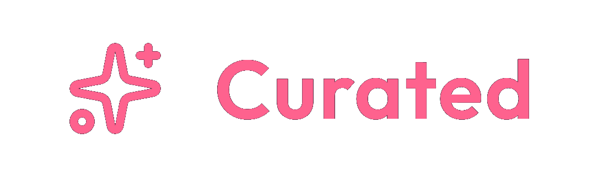

<p align="center">
  
</p>

<p align="center">
  English | <a href="README.zh-CN.md">简体中文</a> | <a href="README.ja-JP.md">日本語</a>
</p>

<p align="center">
  <a href="https://img.shields.io/badge/Vue-3-42b883?style=flat-square&logo=vuedotjs&logoColor=white"></a>
  <a href="https://img.shields.io/badge/TypeScript-5.x-3178c6?style=flat-square&logo=typescript&logoColor=white"></a>
  <a href="https://img.shields.io/badge/Vite-8.x-646cff?style=flat-square&logo=vite&logoColor=white"></a>
  <a href="https://img.shields.io/badge/Go-1.25+-00add8?style=flat-square&logo=go&logoColor=white"></a>
  <a href="https://img.shields.io/badge/SQLite-modernc-003b57?style=flat-square&logo=sqlite&logoColor=white"></a>
  <a href="https://img.shields.io/badge/Tailwind_CSS-v4-06b6d4?style=flat-square&logo=tailwindcss&logoColor=white"></a>
  <a href="https://img.shields.io/badge/shadcn--vue-ui-111111?style=flat-square"></a>
  <a href="https://img.shields.io/badge/Windows-tray_ready-0078d4?style=flat-square&logo=windows&logoColor=white"></a>
</p>

# Curated

Curated is a local-first media library: Vue 3 frontend, Go + SQLite backend, and an Electron desktop shell. The product name is **Curated**. The repository folder and npm package may still use **`jav-shadcn`**.

This README is the short public entry. For setup details, configuration, packaging, and links into the rest of `docs/`, see **[docs/guide.md](docs/guide.md)**. The HTTP API reference is **[API.md](API.md)**.

## Download

Official Windows packages are on **[GitHub Releases](https://github.com/yepHiu/Curated/releases)**. Use the [latest release](https://github.com/yepHiu/Curated/releases/latest).

- **Installer (recommended):** `Curated-Setup-<version>.exe`
- **Portable:** `Curated-<version>-windows-x64.zip`

Installed apps can also check and download a newer installer from Settings → About.

## Highlights

- Local-first Vue 3 SPA, Go HTTP API, SQLite, and a Windows-oriented Electron tray shell.
- Dual-mode development: real Web API or Mock UI behind the same service layer.
- Library browsing, scraping, import, playback, curated frames, actor identities, recommendations, and personal insights.
- Optional PIN App Lock, verified backups, path migration, and Library Health repairs.
- Experimental AI chat and editing previews with explicit confirmation; see the [handbook](docs/guide.md#experimental-ai).
- GitHub Releases update checks with in-app installer download; packaged builds ship FFmpeg and a local `hls.js` runtime.

## Quick start

Requirements: Node.js current LTS (Vite 8), **pnpm**, Go `1.25.4+`.

```bash
cd backend && go run ./cmd/curated
```

```bash
pnpm install
pnpm dev
```

- Backend default: `http://127.0.0.1:8080` (loopback), health name `curated-dev`.
- Frontend default: `http://localhost:5173`.
- Set `VITE_USE_WEB_API=true` in root `.env` for the real API; otherwise Mock mode.
- Desktop shell: `pnpm dev:electron`.
- Windows dev binary: `pnpm backend:build:dev` → `backend/runtime/curated-dev.exe`.

Backup, restore, path migration, configuration keys, and release packaging are documented in [docs/guide.md](docs/guide.md).

## Documentation

| Document | What it is |
| --- | --- |
| [docs/guide.md](docs/guide.md) | Detailed handbook and documentation index |
| [project-overview-dashboard.html](project-overview-dashboard.html) | Visual snapshot of project delivery, active requirements, Git, and worktrees |
| [API.md](API.md) | Public HTTP API reference |
| [docs/features/2026-05-03-feature-inventory.md](docs/features/2026-05-03-feature-inventory.md) | Shipped vs target feature catalog |
| [docs/README.md](docs/README.md) | How `docs/` subfolders are used |

## Repository layout

```text
src/        Vue SPA
backend/    Go module curated-backend (`cmd/curated`)
electron/   Desktop shell MVP
config/     Library-level runtime config (stays at repo root)
docs/       Handbook, reference, product, ops, plan, PRD
icon/       Brand source assets (wordmark / appicon / mark)
```

## Notes

- Current phase is web-first with a minimal Electron shell. Deeper IPC, mpv, and broad native bridges remain target-direction work.
- `docs/film-scanner/` is reference material, not the production module tree.

## Models that helped build this project

When a later large language model takes over work in this repository, add its name to the list below.

- Composer 2.5
- DeepSeek V4
- GPT 5.5
- GPT 5.6 Terra sol
- Grok 4.6
