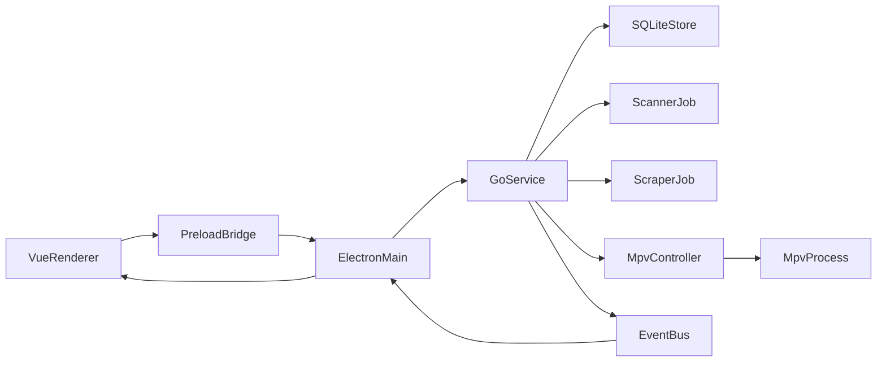

# Curated 架构评审

## 1. 评审结论

`docs/2026-03-20-jav-libary.md` 作为目标产品蓝图是成立的，核心模块划分也基本合理；但如果结合当前仓库现状评估，这份方案更适合作为“目标态架构说明”，而不是“当前工程实现说明”。

当前仓库仍是一个 `Vue 3 + TypeScript + Vite + shadcn-vue` 的前端起步壳，尚未接入 `Electron`、`Go`、`SQLite`、`mpv` 以及桌面桥接层。因此，后续实施不能直接从最终态倒推编码，而应先建立一层可演进的前端骨架与协议边界。

## 2. 方案优点

- 模块职责大方向清晰，`Library Manager`、`Scanner Service`、`Metadata Scraper`、`Player Controller`、`Database Layer` 的边界具备可扩展性。
- 以 `num` 作为影片识别主键方向合理，便于扫描、搜刮、缓存和 UI 查询形成统一索引。
- 将 `mpv` 播放控制放在本地服务侧而非直接塞进前端，是正确的职责划分。
- 提前考虑搜刮器接口抽象，有利于未来接入多数据源。
- UI 页面拆分为影片库、详情、播放器、设置四类主页面，符合桌面媒体库应用的常见信息架构。

## 3. 主要问题与风险

### 3.1 当前仓库与目标方案存在断层

- 当前仓库没有 `Electron` 主进程、`preload`、`Go` 工程、`SQLite` 实现或播放器桥接代码。
- 现有前端连路由、状态管理、服务层和领域模型都尚未建立。
- 如果直接按照目标蓝图向页面里堆功能，后续会很难从纯前端壳平滑演进到桌面应用。

### 3.2 通信链路定义不够统一

文档里同时出现了以下表述：

- `Vue Renderer -> Electron Main` 使用 `IPC`
- `Electron Main -> Go Backend` 使用 `HTTP / IPC`
- `Go Backend -> mpv` 使用 `JSON IPC`

这说明当前方案还没有明确“唯一主链路”。

建议统一为：

- Renderer 只调用 `preload` 暴露的前端桥接 API
- `Electron Main` 负责转发到 `Go` 服务
- `Go` 内部再管理数据库、扫描、搜刮和 `mpv`
- `mpv` 事件由 `Go` 汇总后回推至 `Electron Main`，再转给 Renderer

也就是说，Renderer 不应同时感知 `Electron IPC`、`HTTP`、`命名管道` 多套细节。

## 4. 推荐的统一链路

## 5. 后台任务建模建议

当前方案把扫描、搜刮、封面下载、缩略图生成都写成流程步骤，但还没有把它们抽象成任务系统。这个缺口会直接影响可观察性和 UI 体验。

建议至少补齐以下任务语义：

- `queued`
- `running`
- `success`
- `failed`
- `cancelled`

每个任务应具备最基本字段：

- `taskId`
- `type`
- `status`
- `progress`
- `startedAt`
- `finishedAt`
- `errorCode`
- `errorMessage`
- `payload`

这样前端才能稳定展示：

- 当前是否正在扫描
- 某个目录扫描到了哪一步
- 哪个番号搜刮失败
- 缩略图是否仍在生成
- 播放器事件是否与某次任务相关

## 6. 数据模型改进建议

当前文档中的 `movies`、`actors`、`tags`、关联表适合 MVP，但还不足以支撑长期演进。

建议后续补充的字段或表：

- `movies`
  - `source_path`
  - `file_size`
  - `hash`
  - `scan_status`
  - `metadata_status`
  - `cover_status`
  - `last_played_at`
  - `play_count`
- `movie_files`
  - 处理单影片多文件、不同清晰度、字幕、外挂资源
- `scrape_records`
  - 记录搜刮来源、时间、是否成功、失败原因
- `assets`
  - 统一记录封面、缩略图、预览图、本地缓存路径
- `scan_jobs`
  - 记录扫描任务生命周期与结果摘要
- `settings`
  - 用结构化方式管理全局配置，而不是只依赖一个未经版本管理的平面 `config.json`

## 7. 播放器方案改进建议

`mpv --wid=<window_id>` 在 Windows 上可以作为可行方向，但实施前要先明确责任边界：

- `Electron` 负责窗口生命周期与宿主环境
- `Go` 负责 `mpv` 进程管理和命名管道通信
- Renderer 只消费播放状态和控制命令，不直接接触底层播放器协议

播放相关还需要提前定义：

- 状态枚举：`idle`、`loading`、`playing`、`paused`、`ended`、`error`
- 事件枚举：`time-pos`、`duration`、`pause`、`end-file`、`file-loaded`
- 控制命令 DTO：`play`、`pause`、`seek`、`setVolume`、`toggleFullscreen`

否则 UI、Electron、Go 三层会各自生长出一套不一致的播放状态模型。

## 8. 前端架构改进建议

当前阶段最应该做的不是直接实现桌面能力，而是让前端具备承接桌面能力的结构。

建议先补：

- `router`
- `views`
- `layouts`
- `services`
- `types`
- `stores`
- `mock adapters`

其中最重要的是 `services` 和 `types`：

- `services` 负责对外暴露统一的前端调用接口
- `types` 负责定义领域模型、DTO、任务事件和错误码

这样未来可以先接 mock，再接 Electron，再接 Go，而不是每次都重写 UI 层。

## 9. 分阶段实施建议

### 第一阶段：前端应用骨架

- 建立页面结构、导航、布局和状态管理
- 补充影片列表、详情、设置页的静态骨架
- 用 mock 数据打通基础交互

### 第二阶段：协议先行

- 定义 `library`、`scan`、`scraper`、`player`、`settings` 五类前端服务接口
- 定义 DTO、事件类型、任务状态、错误码
- 明确 Renderer 只能通过桥接服务访问桌面能力

### 第三阶段：桌面运行时

- 接入 `Electron`
- 增加 `preload` 与安全边界
- 定义 `Electron Main <-> Go` 的单一通信方式

### 第四阶段：后台能力

- 接入扫描服务
- 接入元数据搜刮
- 接入缓存与缩略图生成
- 接入日志与错误追踪

### 第五阶段：播放器与体验

- 接入 `mpv`
- 完善播放器状态同步
- 处理进度、暂停、结束、异常事件

## 10. 结论性建议

这份方案的正确打开方式不是“立即按终态开发”，而是“把终态方案拆成可演进的中间层”。对当前仓库而言，最关键的改进建议只有三条：

1. 先把前端从演示壳升级为真正的应用骨架。
2. 先定义协议和边界，再接桌面 runtime。
3. 把扫描、搜刮、缓存、播放全部任务化和事件化，而不是只写静态流程图。
