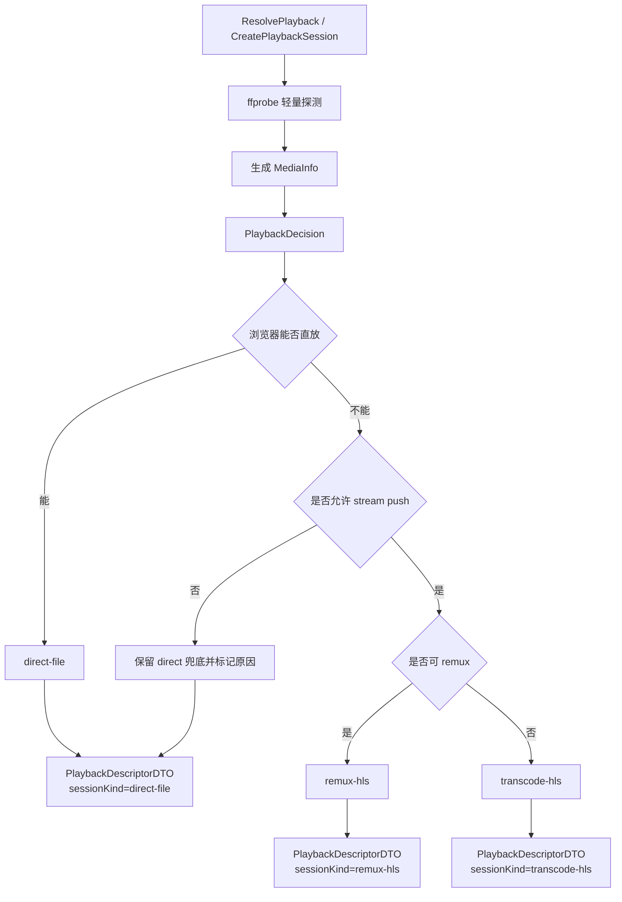
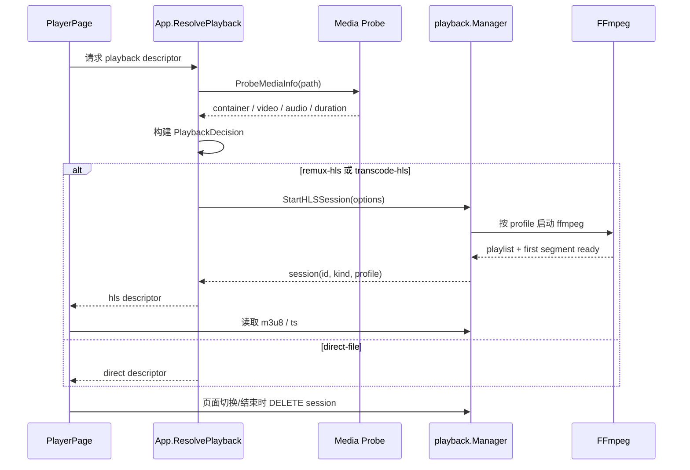

# Curated 播放链路优化计划

## 文档目的

基于 `docs/2026-04-09-Jellyin的播放链路实现.md` 中总结的 Jellyfin 播放实现方式，对比 Curated 当前已经落地的播放链路，给出下一阶段的优化方向、分期实施方案与开发顺序。

本文以 **当前代码事实** 为准，不把旧计划文档中的历史表述当成现状。

---

## 1. 当前 Curated 播放链路事实

当前仓库里的播放链路已经不是“只有 `/stream` + `<video>`”这一种路径，而是一个轻量的三分支模型：

### 1.1 已实现的播放入口

- 前端先请求 `GET /api/library/movies/{id}/playback`
- 后端返回 `PlaybackDescriptorDTO`
- 前端根据 `descriptor.mode` 决定实际播放路径

当前支持：

- `direct`
  - 浏览器直接播放 `GET /api/library/movies/{id}/stream`
- `hls`
  - 后端创建 HLS 会话
  - 前端通过 `/api/playback/sessions/{sessionId}/hls/index.m3u8` 播放
- `native`
  - 后端保留 `POST /api/library/movies/{id}/native-play`
  - 但前端默认更偏向 **浏览器协议模板拉起本机播放器**

### 1.2 当前后端实现特征

- `backend/internal/app/app.go`
  - `ResolvePlayback()` 负责返回播放描述符
  - `CreatePlaybackSession()` 负责显式创建 HLS 会话
  - `shouldPreferHLS()` 目前主要根据 **文件扩展名** 与 `forceStreamPush` 决定是否优先 HLS
- `backend/internal/playback/manager.go`
  - 负责启动 FFmpeg，生成 HLS 播放列表和 ts 分段
  - 支持按平台尝试 `nvenc / qsv / amf / videotoolbox / libx264`
  - 会等待首个 playlist、首个 segment 就绪后再返回
  - 当前会话清理主要依赖：
    - 同一 movie 新会话替换旧会话
    - 前端主动 `DELETE /api/playback/sessions/{id}`
    - 应用关闭时统一清理
- `backend/internal/nativeplayer/launcher.go`
  - 支持 `mpv / potplayer / custom` 预设
  - 仍是“拉起进程”级别，不包含 IPC 控制或状态回传

### 1.3 当前前端实现特征

- `src/components/jav-library/PlayerPage.vue`
  - 先读播放描述符
  - HLS 模式下支持：
    - 预热 playlist / segment
    - `hls.js` 动态加载
    - HLS 失败后退回 direct
    - 页面切换 / 结束时清理 HLS 会话
- `src/lib/hls-player.ts`
  - 当前 `hls.js` 通过 CDN 动态加载
  - 有原生 HLS 判断和预热逻辑
- `src/lib/native-player-launch.ts`
  - 当前默认走浏览器协议模板，例如 `potplayer:{url}`
  - 模板按机器保存在 `localStorage`

### 1.4 当前实现的主要短板

- 播放模式决策仍偏粗糙，核心依据还是 **扩展名**，不是媒体探测结果
- 没有 Jellyfin 那种统一的 `StreamState` / “能力协商结果”对象
- 没有单独的 **DirectStream/Remux** 路径，只有：
  - direct
  - HLS 转码
  - native handoff
- HLS 会话仍是“单码率、单 profile、单 playlist”
- 没有转码任务状态、健康状态、会话观测面板
- 缺少自动清理和闲置回收策略
- 音轨、字幕轨、容器/编解码能力信息在描述符里基本还是空壳
- 原生播放器链路没有 IPC 回传，无法形成“外部播放但仍可同步进度/状态”的闭环
- HLS 依赖 `jsdelivr` 动态加载 `hls.js`，离线、内网或被拦截时可靠性一般

---

## 2. Jellyfin 与 Curated 的核心差异

## 2.1 Jellyfin 的关键优点

从参考文档看，Jellyfin 的播放链路核心不是“多一个 HLS 接口”，而是这几层能力：

- **统一的流状态构建**
  - 所有请求先进入类似 `GetStreamingState()` 的统一决策层
- **模式清晰**
  - `DirectPlay`
  - `DirectStream`（重封装 / copy）
  - `Transcode`
- **基于媒体能力和客户端能力决策**
  - 不是只看文件扩展名
- **转码任务有生命周期管理**
  - job 对象
  - 活跃请求计数
  - 节流器
  - 分段清理器
  - 详细日志
- **HLS 不是“有一条 m3u8”就结束**
  - 有 master playlist
  - 有变体 / 自适应码率空间
  - 有 segment 生命周期管理

## 2.2 Curated 当前的优势

Curated 也有 Jellyfin 不需要但很适合本项目的优势：

- 明确是 **本地优先**
- 当前运行形态是 **本地后端 + 浏览器 UI + Windows 托盘**
- 有可用的 HLS 会话原型，不需要从零起步
- 有浏览器侧本机播放器协议拉起路径，适合 Windows 本地用户

## 2.3 当前最关键的差距

Curated 当前最缺的不是“再多加一个 endpoint”，而是：

1. **播放能力分析层**
2. **统一的播放会话状态模型**
3. **direct / remux / transcode 的清晰分层**
4. **HLS 会话生命周期治理**
5. **原生播放器闭环能力**

---

## 3. 优化原则

### 3.1 不要照搬 Jellyfin

Jellyfin 的设计是面向通用媒体服务器、多终端、多设备协商。

Curated 当前更适合：

- 保持本地优先
- 保持浏览器内播放可用
- 在必要时才进入 HLS / native 分支
- 不引入过重的服务端状态和复杂分发模型

### 3.2 先补决策层，再补转码层

当前已经有 HLS 和 native 分支，但决策层太薄。

正确顺序应该是：

1. 先补“为什么选 direct / hls / native”
2. 再补“选中之后如何更稳定地执行”

### 3.3 先把浏览器内体验做稳，再做高级能力

短期内最影响用户体验的不是 ABR，而是：

- 不兼容格式是否能稳定兜底
- 会话是否会泄漏
- 切换播放是否足够快
- 外部播放器拉起后是否还能正确记录进度

---

## 4. 推荐优化方向

## 4.1 方向一：建立 Playback Capability / Session State 层

新增一个统一的播放能力分析与会话决策层，职责类似 Jellyfin 的 `StreamingState`，但更轻量。

建议新增内部结构：

- `PlaybackCapability`
  - 容器
  - 视频编码
  - 音频编码
  - 分辨率
  - 码率
  - 是否浏览器友好
  - 是否可 remux
  - 是否建议 native
- `PlaybackPlan`
  - chosenMode: `direct | remux-hls | transcode-hls | native`
  - reasonCode
  - reasonMessage
  - expectedContainer
  - preferredSessionProfile

这样 `ResolvePlayback()` 就不再是“看到 mkv 就 HLS”，而是：

- 先 probe
- 再生成 capability
- 再生成 plan
- 最后输出 descriptor

## 4.2 方向二：把 HLS 从“会跑”升级到“可治理”

当前 HLS 已经能用，但治理能力偏弱。

建议补齐：

- session idle timeout
- 后端后台清理器
- 最近会话索引 / 观测接口
- FFmpeg stderr 落盘或归档
- profile 命中统计
- 会话失败原因结构化返回

至少要知道：

- 为什么走到 HLS
- 用了哪个 encoder profile
- FFmpeg 是否降级到软件编码
- 会话失败在“启动阶段”还是“首分段阶段”

## 4.3 方向三：增加 Remux 层，而不是只有全量转码

Jellyfin 的一个关键优点是 `DirectStream`。

Curated 当前缺这一层，导致很多“浏览器不喜欢容器，但并不需要重编码”的情况只能走完整 HLS 转码。

建议补一个中间态：

- `remux-hls`
  - 视频 / 音频尽量 `copy`
  - 只改容器 / 分段输出
- `transcode-hls`
  - 需要重编码时才启用

这样可以显著降低：

- 启动时间
- CPU/GPU 压力
- 首帧等待

## 4.4 方向四：原生播放器从“拉起”升级到“可回写”

当前浏览器协议拉起很适合本地 Windows 使用，但它是单向链路。

下一阶段不建议直接上复杂 IPC 控制，而是先做一个低成本闭环：

- 启动时把：
  - 影片 ID
  - 起播时间
  - 会话 ID
  - 目标 URL / 文件路径
  记录到本地会话表
- 当用户从外部播放器返回 Curated 时：
  - 至少能恢复“最近一次外部播放会话”
  - 支持手动回填播放进度

更进一步才考虑：

- mpv IPC
- 外部播放器状态轮询
- 外部播放结束后自动更新进度

## 4.5 方向五：把前端的 HLS 依赖从 CDN 改成本地打包依赖

这是一个很实际的稳定性点。

当前 `hls.js` 通过 CDN 动态加载，问题是：

- 外网失败会影响播放
- 内网 / 代理环境不稳定
- 版本可控性差

建议改为：

- 将 `hls.js` 作为前端依赖纳入构建
- 继续保留 lazy load，但从本地 bundle 分包加载

这样可以消掉一类非业务失败。

---

## 5. 分阶段实施计划

## Phase 1：补齐播放决策层

### 目标

让当前播放模式选择从“扩展名 heuristics”升级到“能力分析 + 明确原因”。

### 后端改动

- 新增播放能力探测模块
- `ResolvePlayback()` 改为：
  - probe media
  - build capability
  - build plan
  - emit descriptor
- 给 `PlaybackDescriptorDTO` 增加更明确字段：
  - `decision`
  - `reasonCode`
  - `reasonMessage`
  - `sourceContainer`
  - `sourceVideoCodec`
  - `sourceAudioCodec`
  - `sessionKind`

### 前端改动

- Player 页展示更明确的播放模式和原因
- 调试视图可看到当前是：
  - direct
  - remux-hls
  - transcode-hls
  - browser-native-handoff

### 预期收益

- 播放决策可解释
- 后续优化有数据基础
- 能减少“为什么突然走 HLS / 为什么 fallback”的黑盒感

## Phase 2：引入 Remux HLS

### 目标

在不需要重编码时，避免直接进入完整转码。

### 后端改动

- `playback.Manager` 支持 remux profile
- profile 体系改为：
  - `copy-h264-aac` 或类似 copy/remux 路径
  - hardware transcode
  - software transcode
- 记录会话所用 profile

### 预期收益

- 浏览器不友好容器的片源启动更快
- 降低资源占用

## Phase 3：完善 HLS 会话治理

### 目标

让 HLS 会话具备最基本的服务端治理能力。

### 后端改动

- session TTL / idle timeout
- 后台 janitor 清理器
- 失败日志落盘
- 会话状态查询接口，例如：
  - `GET /api/playback/sessions/{id}`
  - `GET /api/playback/sessions/recent`
- 会话指标：
  - start latency
  - profile name
  - fallback count
  - error category

### 前端改动

- 播放器调试信息
- 设置页增加播放链路诊断入口

### 预期收益

- 会话不易泄漏
- 便于定位 FFmpeg 问题

## Phase 4：增强原生播放器链路

### 目标

保留当前浏览器协议模板方案，但让它不再是“纯盲发”。

### 后端 / 前端改动

- 为浏览器侧 handoff 增加轻量会话记录
- 统一 native launch reason / result
- 优化 mpv / potplayer 模板与 seek 参数兼容性
- 评估是否为 `mpv` 先补最小 IPC 集成

### 预期收益

- 外部播放器路径更稳定
- 后续做进度回写有落点

### Phase 4 实施草案：原生播放器闭环优化

#### 4.4.1 要解决的核心问题

当前浏览器协议模板拉起本机播放器已经可用，但它仍然是单向链路：

- Curated 只负责发起 handoff
- 外部播放器是否成功打开，当前缺少稳定的结果记录
- 用户从外部播放器回到 Curated 后，系统无法恢复“刚才那次外部播放”
- 外部播放结束后，进度只能依赖用户手动重新定位，无法形成回写闭环

因此这一阶段的目标不是“把外部播放器做成桌面内核”，而是先把 native handoff 升级成一条**可记录、可恢复、可回填**的链路。

#### 4.4.2 本阶段范围

本阶段纳入：

- 浏览器侧 native handoff 会话记录
- handoff 结果状态标准化
- 从 Curated 恢复最近一次外部播放会话
- 手动把外部播放位置回填到现有播放进度存储
- 协议模板中的 URL / seek 参数兼容性整理

本阶段不纳入：

- 完整的 `mpv` JSON IPC 控制
- 外部播放器实时状态轮询
- 自动读取播放器当前时间
- 自动在播放结束时标记已看完
- 把浏览器协议 handoff 全量回退成后端 `native-play` 唯一入口

#### 4.4.3 建议架构

保持当前双路径并存：

- 默认路径仍是浏览器侧协议模板 handoff
- 后端 `POST /api/library/movies/{id}/native-play` 保留为 legacy / shell hook

在此基础上补一层 **native handoff session**：

1. 前端决定发起本机播放器 handoff
2. 前端在本地创建一条 handoff session 记录
3. 前端按协议模板拉起外部播放器
4. 前端把 launch result 回写到 handoff session
5. 用户返回 Curated 时，播放器页或详情页可读取最近一次 handoff session
6. 用户可用“一键从外部播放位置继续”或“手动回填到当前进度”

这层 session 与 HLS session 不同：

- HLS session 是后端运行态对象
- native handoff session 是前端主导的本地恢复对象

#### 4.4.4 数据模型建议

建议新增浏览器本地存储键，例如：

- `curated-native-handoff-sessions-v1`

建议记录字段：

- `sessionId`
- `movieId`
- `createdAt`
- `startedAt`
- `updatedAt`
- `launchPath`
  - `protocol-url`
  - `file-path`
  - `stream-url`
- `target`
  - 最终 handoff 的 URL 或文件路径
- `playerPreset`
  - `potplayer`
  - `mpv`
  - `custom`
- `template`
  - 发起时使用的协议模板快照
- `startPositionSec`
  - 发起时传给外部播放器的起播点
- `resumePositionSec`
  - 用户回到 Curated 时手动填写或确认的播放位置
- `launchReason`
  - `explicit_native_button`
  - `prefer_native_player`
  - 未来可扩展
- `launchResult`
  - `pending`
  - `opened`
  - `failed`
  - `cancelled`
  - `returned`
- `lastError`
  - 供 UI 展示失败原因

约束建议：

- 每部影片只保留最近一条 active / recent native handoff session
- 全局 recent 列表保留固定上限，例如 20 到 50 条
- 旧格式由前端静默迁移，不做复杂兼容分支

#### 4.4.5 前端交互建议

播放器页 / 详情页中，本机播放器动作建议拆成两个层次：

- 主动作：`在本机播放器中打开`
- 返回站内后的恢复动作：
  - `继续上次外部播放位置`
  - `回填外部播放进度`

交互建议：

1. 用户点击“在本机播放器中打开”
2. 前端创建 handoff session，状态为 `pending`
3. 前端执行协议模板替换并发起跳转
4. 如果浏览器侧没有抛出明显错误，则记为 `opened`
5. 当用户回到 Curated，若存在该影片最近一次 `opened` handoff session：
   - 展示一张轻量提示卡
   - 默认给出“从起播点继续”和“手动输入当前位置回填”两个动作
6. 用户确认回填后，复用现有 `saveProgress()` / playback progress 存储链路

这里故意不做“自动推断播放到了哪里”。
原因很简单：当前没有可靠 IPC，强行自动化只会制造脏进度。

#### 4.4.6 后端角色边界

这一阶段后端只做配角，不重新接管主链路。

建议保持：

- `native-play` 作为 legacy 能力继续存在
- 设置页中的播放器运行时配置继续保留

可选补充但不强依赖：

- 如后续希望让前端也能统一展示“native launch reason / result”，可以增加一个轻量 DTO 约定，但本阶段不要求新增后端持久化表
- 如某些平台需要后端参与构造 file path / session URL，也应只提供辅助接口，不把浏览器 handoff 全量迁回后端

#### 4.4.7 代码落点建议

前端建议新增或调整：

- `src/lib/native-player-launch.ts`
  - 继续负责模板替换与 handoff 发起
  - 但不再只返回布尔结果，应返回结构化 launch result
- `src/lib/native-handoff-session-storage.ts`
  - 新增，专门管理本地 handoff session 的创建、更新、裁剪、查询
- `src/components/jav-library/PlayerPage.vue`
  - 增加 handoff session 恢复提示与手动回填入口
- `src/components/jav-library/MovieDetailView.vue` 或等效详情动作组件
  - 在非播放器场景下也能恢复最近一次外部播放会话
- `src/api/types.ts`
  - 如前端已有统一 launch result DTO，可在此补齐类型；若纯前端存储可不新增 API DTO

测试建议覆盖：

- `native-player-launch` 模板替换
- session storage 的 upsert / trim / migrate
- Player 页恢复提示显示逻辑
- 手动回填后对现有 playback progress 存储的写入

#### 4.4.8 建议拆分为 4 个交付批次

批次 A：native handoff session 存储层

- 新增本地存储模块
- 定义数据结构、迁移、裁剪、按影片读取 recent session
- 为后续 UI 提供稳定查询接口

批次 B：结构化 launch result

- `native-player-launch` 返回结构化结果，而不是只做 fire-and-forget
- 统一 `launchReason` / `launchResult` / `lastError`
- 把模板与 seek 参数最终展开值写入 session

批次 C：恢复与手动回填 UI

- Player 页识别最近一次外部播放会话
- 提供“从上次起播点继续”和“手动回填进度”
- 回填成功后同步刷新当前页进度态

批次 D：`mpv` 最小 IPC 预研

- 仅验证是否能低成本拿到当前位置或退出事件
- 不承诺在本阶段正式接入
- 输出是否值得进入下一阶段的结论

#### 4.4.9 验收标准

满足以下条件即可认为 Phase 4 第一版完成：

- 用户从播放器页触发本机播放器 handoff 后，会产生一条可查询的 recent handoff session
- 同一影片重复 handoff 不会无限堆积脏记录
- 用户返回 Curated 后，能看到最近一次外部播放会话的恢复入口
- 用户可以手动输入或确认当前位置，并成功回写到现有播放进度链路
- 失败 handoff 有可见原因，不再是纯静默失败
- 不破坏现有浏览器内 direct / HLS 播放路径

#### 4.4.10 风险与边界

主要风险：

- 浏览器协议拉起本身天然不可完全观测，`opened` 只能表示“已发起且未立即失败”，不能证明播放器一定成功播放
- 不同播放器对 URL 编码、seek 参数、命令模板的兼容性差异很大
- 如果把“自动进度同步”也塞进本阶段，复杂度会明显失控

因此本阶段的取舍应该保持清晰：

- 先解决“记不住、回不来、无法回填”
- 暂不承诺“自动同步、远程控制、实时状态”

#### 4.4.11 推荐落地顺序

推荐先后顺序：

1. `native-handoff-session-storage.ts`
2. `native-player-launch.ts` 结构化结果改造
3. Player 页恢复提示与手动回填
4. 详情页入口复用
5. `mpv` 最小 IPC 预研结论文档

## Phase 5：高级流媒体能力

这部分放最后，不建议当前就做。

候选项：

- master playlist / 多码率 ABR
- 字幕轨与音轨显式暴露
- 更细的硬件编码策略
- 真正的转码节流器
- 进程级转码任务面板

---

## 6. 推荐开发顺序

如果要控制投入并尽快得到收益，推荐顺序是：

1. **Phase 1**
   - 播放能力分析
   - 描述符字段补强
   - 前端模式显示与调试信息
2. **Phase 2**
   - remux-hls
   - session profile 记录
3. **Phase 3**
   - session 清理器
   - 会话状态 / 日志观测
4. **Phase 4**
   - native handoff 会话闭环
5. **Phase 5**
   - ABR / 字幕音轨 / 高级调度

---

## 7. 我的建议

结合当前代码和 Jellyfin 的参考实现，我不建议直接追求“大而全的 Jellyfin 化”，而建议先做下面这三件：

### 优先级 A

先做 **播放能力分析层 + 决策原因结构化**。

这是后面所有优化的基础，而且对当前代码侵入最小。

### 优先级 B

紧接着做 **Remux HLS**。

这会比“继续只用扩展名决定是否完整转码”更值，也最能直接改善启动速度和资源消耗。

### 优先级 C

然后做 **HLS 会话治理**。

当前系统已经有会话，但还没有把它当作一个正式的、可观测、可清理的服务端对象来经营。

---

## 8. 一句话结论

Jellyfin 的启发不在于“多了 HLS 和 FFmpeg”，而在于它把播放链路拆成了：

- 能力分析
- 模式决策
- 会话管理
- 转码治理

Curated 当前已经有：

- 播放描述符
- HLS 会话
- 本机播放器分支

所以下一步最合理的路线不是推倒重来，而是：

**先把当前链路补成“有决策、有分层、有治理”的播放管线，再逐步加 remux、原生播放器闭环和高级流媒体能力。**
---

## 9. 流程图与图例

### 9.1 当前链路

```mermaid
flowchart TD
    A[PlayerPage 进入播放页] --> B[GET /api/library/movies/{id}/playback]
    B --> C{descriptor.mode}
    C -->|direct| D[/api/library/movies/{id}/stream]
    C -->|hls| E[已有 HLS 会话或新建会话]
    E --> F[/api/playback/sessions/{id}/hls/index.m3u8]
    C -->|native| G[浏览器协议模板拉起本机播放器]
    F --> H[video / hls.js 播放]
    D --> H
```

### 9.2 目标决策链路



### 9.3 HLS 会话生命周期



### 9.4 HLS 会话治理

```mermaid
flowchart TD
    A[StartHLSSession 成功] --> B[注册 active session]
    B --> C[读取 m3u8 / ts]
    C --> D[更新 lastAccessedAt]
    D --> E[重新计算 expiresAt]
    B --> F[定时 janitor tick]
    F --> G{是否超出 idle timeout}
    G -->|否| C
    G -->|是| H[归档 session snapshot]
    H --> I[停止 ffmpeg 并清理临时目录]
    I --> J[recent/status API 仍可查询]
    B --> K[DELETE /api/playback/sessions/{id}]
    K --> H
```

### 9.5 图例

- `direct-file`：浏览器直接读取 `/stream`，不创建 HLS 会话。
- `remux-hls`：进入 HLS，但优先 `-c:v copy -c:a copy`，只做容器/分段重封装。
- `transcode-hls`：进入 HLS，并进行完整视频或音频转码。
- `reasonCode`：机器可判定的决策原因，便于前端诊断和后续日志聚合。
- `reasonMessage`：给人看的解释文本。
- `sourceContainer / sourceVideoCodec / sourceAudioCodec`：当前片源探测结果，用于解释“为什么不是 direct”。

## 10. 本轮开发落地范围

### 已落地

- 后端新增基于 `ffprobe` 的轻量媒体探测，补齐容器、首视频编码、首音频编码、时长信息。
- `ResolvePlayback()` / `CreatePlaybackSession()` 已改为“探测 -> 决策 -> 输出 descriptor”链路，不再只靠扩展名猜测。
- `PlaybackDescriptorDTO` 已扩展：
  - `sessionKind`
  - `reasonCode`
  - `reasonMessage`
  - `sourceContainer`
  - `sourceVideoCodec`
  - `sourceAudioCodec`
- HLS manager 已支持 remux-first profile：
  - 满足 HLS 友好编码时优先 `remux_copy`
  - 失败后继续回退到硬件/软件转码 profile
- HLS session manager 已补齐基础治理能力：
  - idle timeout + janitor 周期清理
  - `GET /api/playback/sessions/recent`
  - `GET /api/playback/sessions/{id}`
  - 最近会话快照归档，显式删除或 janitor 清理后仍可观测最近状态
- 播放页详细统计面板已展示：
  - Session 类型
  - Reason Code
  - Reason Message
  - Source Format

### 尚未落地

- FFmpeg stderr 归档与 profile 命中统计
- native handoff 会话闭环
- `hls.js` 从 CDN 切换为本地打包依赖
