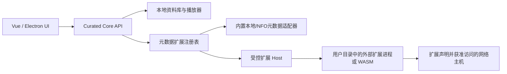

# Curated 合规化与元数据源解耦研究方案

> 状态：研究与目标方案，尚未实施。
>
> 日期：2026-07-18
>
> 适用范围：Curated 的公开仓库、安装包、默认运行行为、元数据扩展机制与对外说明。

## 1. 结论先行

Curated 可以被改造成一个默认只管理本地媒体、默认不访问任何成人元数据站点、并由用户自行安装元数据扩展的通用媒体资料库。推荐目标不是“把成人用途藏起来”，而是让公开分发的核心应用在代码、二进制、默认配置、示例数据和网络行为上都真正保持中性，并对扩展能力进行显式、可审计的隔离。

仅修改 `library-config.cfg` 中的 provider 列表不构成真正解耦。当前 `metatube-sdk-go v1.3.2` 的 `engine/register.go` 会通过空白导入把约 35 个成人元数据 provider 静态编译进后端；而 Curated 当前的空 provider / 空 chain 还表示“自动使用全部已注册源”。因此：

- 把 provider 名称移出默认配置，可以改善安装包表面与默认选择，但不能移除二进制中的 provider 实现。
- 新增一个默认关闭的配置字段，可以阻止默认联网，但不能单独证明分发包是通用核心。
- 若要达到较强的公开分发边界，必须让公开核心不再依赖或编译 `metatube-sdk-go` 的站点实现，把具体数据源移入用户自行安装的独立扩展包。

推荐最终形态是“Curated Core + 外部元数据扩展”，而不是“同一二进制 + 隐藏开关”。

## 2. 合规边界

本方案是技术与产品风险控制建议，不是针对任何司法辖区的正式法律意见。公开或向朋友分发软件时，仍应单独评估所在地关于淫秽信息传播、未成年人保护、著作权、网站条款、反爬规则、个人信息与软件分发的要求。

需要坚持以下边界：

1. 对外描述应真实：可以称为“本地优先的媒体资料库”，但不应通过虚假截图、虚假功能说明或秘密解锁说明误导审核方、托管平台或用户。
2. “朋友之间分享”不应被假设为天然免责场景。
3. 插件化本身不自动消除责任。如果核心项目官方打包、托管、自动下载、推荐或定向宣传特定成人站点扩展，技术拆分仍可能不构成实质隔离。
4. 不在核心仓库、核心发布页和核心更新通道中附带成人数据源包、站点清单、成人海报、真实番号样例或一键下载链接。
5. 用户导入的本地媒体与扩展配置应默认留在本机，不上传、不遥测、不进入崩溃报告。

## 3. 当前代码事实与风险审计

### 3.1 当前已有的中性基础

- 产品正式名已是 `Curated`。
- `package.json` 的产品描述已是 `Curated — local-first media library (Vue + Go)`。
- UI 主流程本质上可复用于通用媒体：本地资料库、详情、播放、标签、收藏、历史、资料编辑、媒体导入、存储状态与 PIN 保护。
- release 数据已使用 `%LOCALAPPDATA%\Curated` 等用户数据目录，具备承载用户扩展目录的基础。
- 第三方元数据实现已经集中在 `backend/internal/scraper/metatube` 适配层，没有散落到全部业务包；这为后续替换适配器提供了较好边界。

### 3.2 当前明显的公开痕迹

| 层面 | 当前事实 | 风险 |
|---|---|---|
| npm / 仓库标识 | `package.json.name` 仍为 `jav-shadcn` | 包元数据、构建日志和仓库地址会直接暴露用途历史 |
| 前端源码 | `src/components/jav-library`、`src/lib` 的历史命名与多处 `jav-*` localStorage key | 公开源码、DevTools 与浏览器存储中可见 |
| Electron bridge | preload 暴露 `window.javLibrary.pickDirectory()` | 渲染器全局对象直接带有用途标识 |
| UI 文案 | 中文存在“番号”“片商”，路径示例含 `D:\Media\JAV` | 默认界面和截图不完全中性 |
| 网络设置 | UI 与 API 暴露 `/api/proxy/ping-javbus`，并显示“测试 JavBus 连通” | 默认安装可见特定站点能力 |
| 文档 | README、API.md、CLAUDE.md 明示 JavBus、Metatube 成人元数据、特殊番号规则 | 公开仓库用途清晰可见 |
| 测试 / Mock | 测试与 Mock 路径含 `JAV`，provider 名含 JavBus/JavDB 等 | 即使 UI 清理，源码审计仍会发现大量定向样例 |
| 扫描器 | `backend/internal/scanner/number.go` 特化 FC2、Heyzo、Tokyo-Hot 等编号 | 核心代码不是完全通用的媒体文件识别器 |
| 默认配置样例 | `config/library-config.cfg` 当前含 `AVBASE`、`JAV321`、`JavBus` provider chain，并含本机代理设置 | release 会把它复制成 `library-config.example.cfg`，属于直接发布内容 |
| 依赖 / 二进制 | 后端直接依赖 `metatube-sdk-go v1.3.2`，SDK 静态导入全部站点 provider | 即使配置隐藏，核心二进制仍携带站点实现和域名 |

### 3.3 当前默认行为中的关键陷阱

当前 `MetadataMovieProvider == ""`、`MetadataMovieProviderChain == []` 或 `metadataMovieScrapeMode == "auto"` 并不是“禁用元数据”，而是走 `SearchMovieAll`，即自动使用所有已注册 provider。

所以实施中不能简单地清空：

```json
{
  "metadataMovieProvider": "",
  "metadataMovieProviderChain": []
}
```

上述配置在当前实现中反而保留了全源抓取能力。必须引入一个独立于 provider 选择的总策略字段，并让后端在进入任何刮削任务前先执行强制门控。

### 3.4 当前 release 打包泄漏

`scripts/release/release_lib/build_steps.py` 会把仓库根目录的 `config/library-config.cfg` 原样复制到：

```text
resources/app/runtime/config/library-config.example.cfg
```

由于当前开发机配置包含成人 provider chain、代理地址、播放器命令和库 ID，这不仅不适合作为公开样例，也可能意外携带个人环境信息。发布流程应改为复制一个专门维护、可复现、无本机状态的 `config/library-config.example.cfg`，并对 release 内容做敏感字段检查。

## 4. 目标产品定义：默认安全的通用媒体资料库

公开核心应满足以下可验证定义：

- 干净安装后只提供本地文件扫描、通用媒体浏览、播放、标签、备注、收藏、历史、导入、存储管理和安全设置。
- 不内置成人站点 provider，不自动访问任何第三方元数据站点。
- 不使用成人海报、演员、番号、站点名或成人目录作为默认样例。
- 未安装扩展时，元数据页面显示“未安装元数据扩展”，而不是“自动全源”。
- 用户必须自行取得扩展包、自行放入用户数据目录，并在 UI 中显式确认启用及网络权限。
- 核心更新与扩展更新分离；核心官方更新源不返回第三方扩展目录。
- 卸载扩展后，核心仍可完整管理已有本地媒体；只是不能通过该扩展更新外部元数据。

对外可以如实描述为：

> Curated 是一款本地优先的个人媒体资料库，用于整理、浏览和播放用户有权管理的本地媒体。第三方元数据能力由用户自行安装和配置，Curated Core 不附带第三方数据源。

## 5. 推荐架构



### 5.1 核心内部边界

保留并泛化现有 `scraper.Service` 思路，拆为传输无关接口：

- `MetadataProviderRegistry`：枚举已安装、已启用、可用的 provider。
- `MovieMetadataProvider`：搜索与获取影片元数据。
- `PersonMetadataProvider`：可选的人物资料能力。
- `ProviderHealthChecker`：只检测该扩展在 manifest 中声明的主机与能力。
- `MetadataProviderHost`：启动、限时、停止和隔离外部扩展。

推荐目录：

```text
backend/internal/metadata/
  contracts.go
  registry/
  localnfo/
  sidecar/
  manifest/
```

业务层继续只依赖内部接口，不直接导入扩展 SDK。`backend/internal/scraper/metatube` 应移出公开核心，或仅存在于不随核心发布的独立扩展工程。

### 5.2 为什么推荐 sidecar / WASM，而不是只读 JSON 列表

| 方案 | 能做什么 | 隔离强度 | 结论 |
|---|---|---:|---|
| JSON provider 名称白名单 | 启用核心二进制里已有的 provider | 低 | 只适合短期私有过渡，不适合作为最终公开核心 |
| JSON/YAML CSS 选择器规则 | 表达部分网页刮削逻辑 | 中低 | 规则复杂、易被远程内容利用、难覆盖 JS/鉴权/反爬，不推荐作为首版 |
| 外部 sidecar 可执行文件 + JSON-RPC/stdio | 扩展自行实现站点逻辑，核心仅持有协议 | 高 | Windows / Go 当前架构下最务实的推荐方案 |
| WASM 扩展 | 更容易限制文件和网络权限 | 高 | 长期理想，但宿主网络 API、签名和 SDK 工作量更大 |

关键事实是：一个仅包含名称和 URL 的小文件不能凭空提供完整站点抓取逻辑。如果核心仍能在收到名称后调用特定站点，说明站点实现仍然内置。要实现真正的来源提取，用户放入的内容必须包含扩展代码，或包含足以执行的受限规则；推荐前者。

## 6. 配置设计

### 6.1 小配置字段：总门控，不做秘密解锁

建议在 `library-config.cfg` 新增：

```json
{
  "metadataSourcePolicy": "disabled"
}
```

允许值：

- `disabled`：默认值。禁止启动外部元数据扩展，任何刮削请求返回稳定错误 `METADATA_DISABLED`。
- `user-installed`：允许加载用户扩展目录；如果目录为空，仍然没有可用 provider。

该字段应只控制“是否允许使用用户扩展”，不应单独把任何成人站点变成可用。用户要使用扩展时，必须同时完成：

1. 把完整扩展包放入规定目录；
2. 将 `metadataSourcePolicy` 改为 `user-installed`，或在设置页做等价的显式确认；
3. 在 UI 中逐个启用扩展并确认其网络权限。

现有字段继续负责“已安装扩展中的选择和顺序”：

```json
{
  "metadataSourcePolicy": "user-installed",
  "metadataMovieScrapeMode": "chain",
  "metadataMovieProviderChain": ["example.movie-db"]
}
```

不建议设计未文档化的布尔值、彩蛋、口令或伪装字段。这类机制不利于审计，也容易被解释为故意规避平台规则。

### 6.2 默认配置样例

公开仓库与发布包中的样例应独立于开发机实际配置：

```json
{
  "metadataSourcePolicy": "disabled",
  "metadataMovieScrapeMode": "specified",
  "metadataMovieProvider": "",
  "metadataMovieProviderChain": [],
  "autoActorProfileScrape": false,
  "proxy": {
    "enabled": false,
    "url": ""
  },
  "organizeLibrary": false
}
```

并补充 release 校验，禁止把以下内容复制进公开样例：

- 非空代理地址；
- 本机 library ID、绝对路径、日志路径；
- 已启用的原生播放器命令；
- 特定成人站点名或域名；
- 非空 provider chain。

### 6.3 用户扩展目录

release 默认路径：

```text
%LOCALAPPDATA%\Curated\extensions\metadata-providers\
  example.movie-db\
    manifest.json
    provider.exe
    LICENSES.txt
```

跨平台路径跟随现有 `curatedDataRoot()`：

- Windows：`%LOCALAPPDATA%\Curated\extensions\metadata-providers`
- macOS：Curated 用户配置根目录下的 `extensions/metadata-providers`
- Linux：`$XDG_DATA_HOME/curated/extensions/metadata-providers` 或 `~/.local/share/curated/...`
- 开发态：建议放在 `.workspace/curated-data/extensions/metadata-providers`，避免继续向仓库根新增运行时目录。

可保留 `CURATED_DATA_DIR` 覆盖，从而让便携版用户明确选择扩展目录。

## 7. 扩展包格式

### 7.1 Manifest 示例

公开核心只提供中性示例，不提供真实成人站点 manifest：

```json
{
  "schemaVersion": 1,
  "id": "example.movie-db",
  "displayName": "Example Movie Database",
  "version": "1.0.0",
  "protocol": "curated.metadata.v1",
  "entrypoint": "provider.exe",
  "capabilities": ["movie.search", "movie.details", "provider.health"],
  "permissions": {
    "networkHosts": ["metadata.example.org"],
    "readLibraryFiles": false,
    "writeLibraryFiles": false
  },
  "integrity": {
    "algorithm": "sha256",
    "entrypoint": "<hex digest>"
  }
}
```

### 7.2 必须校验

- `id` 只允许小写 ASCII、数字、点和连字符，且不能形成路径穿越。
- `entrypoint` 必须解析在当前扩展目录内；拒绝绝对路径、`..`、符号链接逃逸。
- `protocol` 与核心支持版本必须匹配。
- 扩展声明的网络 host 使用精确主机或受控子域规则，不能默认 `*`。
- 核心把 library path、代理、PIN、数据库路径等敏感数据视为不可见；只发送完成请求所需的最小 DTO。
- 每个请求有 deadline、最大响应体、并发上限和进程退出策略。
- 扩展 stdout 只允许协议帧，stderr 进入独立、脱敏日志。
- 首版至少校验 SHA-256；正式分发建议增加作者签名与信任提示，但不能把“签名有效”误写成“内容合规”。

### 7.3 建议协议

使用换行分隔 JSON-RPC 2.0 或等价的长度前缀 JSON，通过 stdio 通信：

```text
provider.initialize
provider.capabilities
movie.search
movie.details
person.search
person.details
provider.health
provider.shutdown
```

长任务仍通过 Curated 现有 task 系统返回 `taskId` 和进度；扩展协议不直接暴露数据库模型或前端组件模型。

建议新增稳定错误码：

- `METADATA_DISABLED`
- `METADATA_EXTENSION_NOT_FOUND`
- `METADATA_EXTENSION_INVALID_MANIFEST`
- `METADATA_EXTENSION_UNTRUSTED`
- `METADATA_EXTENSION_PROTOCOL_MISMATCH`
- `METADATA_EXTENSION_PERMISSION_DENIED`
- `METADATA_EXTENSION_TIMEOUT`
- `METADATA_EXTENSION_CRASHED`
- `METADATA_PROVIDER_EMPTY_RESULT`

## 8. API 与 UI 调整

### 8.1 API 中性化

推荐逐步废弃站点专用 API：

- 废弃 `POST /api/proxy/ping-javbus`。
- 保留通用网络诊断，但不要提供可被任意 URL 利用的 SSRF 接口。
- provider 健康检查只接受已安装的 provider ID，由后端根据 manifest 中的 host 权限执行。
- `GET /api/settings` 增加 `metadataSourcePolicy`、已安装扩展摘要和加载错误摘要。
- `POST /api/providers/reload` 只重新扫描用户扩展目录，不联网下载任何扩展。

建议 provider DTO 增加：

```text
id, displayName, version, origin, enabled, capabilities,
declaredHosts, trustState, healthStatus, lastError
```

其中 `origin` 至少区分 `core`、`user-extension`，UI 不再假设 provider 都来自 Metatube。

### 8.2 默认 UI

未安装扩展时，元数据设置页显示：

- 状态：“未安装元数据扩展”；
- 说明：“Curated Core 默认不附带第三方数据源。你可以从本机导入自己信任且有权使用的扩展包。”；
- 操作：“打开扩展目录”“重新扫描”；
- 不显示任何站点名、成人样例或“自动全源”。

安装扩展后：

- 显示扩展来源、版本、权限主机、校验状态和启用开关；
- 第一次启用前弹出权限确认；
- provider chain 只列出已安装且已启用的扩展；
- 删除扩展只停止后续抓取，不删除已经写入用户资料库的元数据，除非用户另行执行清理。

设置页实现继续遵循现有 `SettingsMetadataSection` 的 Card / nested block 规范，并通过 `useLibraryService()` 与服务合约取数。

## 9. “表面正常化”应改为“产品中性化”

### 9.1 发布包必须优先清理

1. 将 `package.json.name` 迁移为中性包 ID，例如 `curated-desktop`；确认锁文件与 release 脚本影响。
2. 将 Electron preload 新 API 改为 `window.curated.pickDirectory()`；为一个迁移版本保留旧 alias，但生产构建可不再暴露旧名。
3. 把默认 UI 的“番号”改为“媒体编号”或“作品编号”，“片商”改为“制作方/发行方”。
4. 所有路径示例改为 `D:\Media\Movies`、`/Users/you/Movies` 等通用示例。
5. 删除 JavBus 专用连通性按钮与 API，改为已安装扩展自己的健康状态。
6. Mock 数据只用虚构标题、人物、制作方、编号和本地占位图；不能从真实成人数据导出。
7. 默认隐藏“演员资料自动抓取”等依赖扩展的选项；无扩展时保持禁用并解释原因。
8. release 不复制开发机 `library-config.cfg`，只复制受版本控制的纯净 example。

### 9.2 公开源码需要进一步清理

如果目标是公开仓库，而不仅是分享安装包，还需要逐步迁移：

- `src/components/jav-library` → `src/components/media-library`；
- `window.javLibrary` → `window.curated`；
- `jav-library-*` localStorage key → `curated-*`，带一次性兼容迁移；
- 测试路径和 fixture 改为通用媒体路径；
- `backend/internal/scanner/number.go` 中成人站点/编号专用规则移入扩展；核心仅保留通用文件名 token、NFO、文件夹与用户正则规则；
- README、API.md、CLAUDE.md、`.cursor/rules` 与产品设计文档中的历史用途说明重新分层；公开核心只记录真实存在的中性能力。

公开源码不建议只做大规模字符串替换。目录名、存储 key、API 与迁移兼容应按最小修改单元分批完成，避免破坏现有用户数据。

### 9.3 仓库策略

可选方案：

| 策略 | 优点 | 缺点 | 建议 |
|---|---|---|---|
| 继续单仓库，使用 build tag | 维护成本较低 | 成人 provider 代码和历史仍在公开仓库，核心边界不清晰 | 不推荐作为公开核心最终形态 |
| 新建 `curated-core` 公开仓库，当前仓库保留私有迁移历史 | 公开内容最清晰、容易审计 | 需要同步迁移和维护扩展协议 | 推荐 |
| 单仓库移除 provider 并保留完整历史 | 当前 issue/commit 连续 | Git 历史仍可搜索旧内容 | 可用于技术透明，但不适合把目标理解为“抹除历史” |

如果创建新的公开核心仓库，应保留所有第三方许可证、版权声明与必要归属；不能以“合规化”为由删除许可证义务。也不建议为了掩盖历史用途而进行误导性的历史改写。

## 10. 分阶段实施路线

### P0：立即止血（1～2 天）

- 新建纯净 `config/library-config.example.cfg`，release 只复制该文件。
- 清空公开样例中的 provider、代理、本机路径、播放器命令和 library ID。
- 引入 `metadataSourcePolicy=disabled`，在任务入口做硬门控。
- 干净安装默认不自动抓取人物或影片元数据。
- 删除 UI 中 JavBus 专用连通性入口，或在迁移期仅当私有构建明确启用时显示。
- 为打包产物增加敏感字符串和敏感配置检查。

P0 只能保证默认行为和安装包样例更安全，不能移除二进制里的 Metatube provider。

### P1：产品与源码中性化（3～7 天）

- 更新 UI 术语、路径示例、Mock、截图、README 与 package 元数据。
- 迁移 Electron bridge 和 localStorage key，保留一次兼容读取。
- 把站点专用网络 API 改成扩展级健康检查。
- 无扩展时提供完整可用的本地媒体体验与清晰空状态。
- 建立自动化公开痕迹扫描白名单；白名单只允许许可证、迁移说明等必要位置。

### P2：运行时白名单过渡（4～7 天）

- 实现用户目录 `sources.json` 或 manifest 扫描。
- 初始化引擎时仅允许 manifest 选中的 provider；其他 provider 的 priority 设为 0。
- `auto-global` 只能作用于用户明确启用的 provider 集合。
- 配置升级后不自动激活旧 chain，要求用户确认。

P2 仍把 provider 代码编译进二进制，只适合私有过渡、验证 UI 和迁移逻辑，不能作为“核心不含成人源”的完成标准。

### P3：真正拆分扩展（2～4 周）

- 定义 `curated.metadata.v1` 协议与 manifest schema。
- 实现 sidecar host、超时、并发、路径与权限校验。
- 实现内置 `local/NFO` 通用 provider。
- 把 Metatube 适配器迁出核心，核心 `go.mod` 删除 `metatube-sdk-go`。
- 用户扩展包独立构建、独立版本、独立许可证与独立发布边界。
- 完成扩展安装、重载、启停、升级和故障降级测试。

### P4：发布治理（2～5 天）

- 对安装包生成 SBOM 与第三方许可证清单。
- 对二进制、前端 bundle、示例配置、README-release 做敏感字符串检查。
- 干净虚拟机抓取首次启动网络流量，证明核心不会访问第三方元数据站点。
- 准备隐私说明、内容与权利声明、扩展风险说明、漏洞报告入口。
- 根据实际分发渠道单独检查平台条款、年龄分级和地区法律要求。

## 11. 既有安装升级、迁移与兼容策略

### 11.1 兼容目标

合规核心升级不应要求普通用户手工建立目录、编辑 JSON、复制多个文件或重新扫描整个资料库。目标体验是：

- 安装新版本后，原有媒体库、元数据、图片缓存、资料库路径、标签、收藏、评分、评论、播放历史、PIN、播放器与日志设置自动保留。
- 用户选择“继续仅使用本地资料库”时，只需一次确认，不需要安装任何扩展。
- 用户希望继续使用第三方元数据时，最多执行“选择一个扩展包 + 确认权限”两步；应用自动完成解包、校验、安装、旧 provider chain 映射与配置写入。
- 手工修改 `library-config.cfg` 和手工复制扩展目录仅作为高级用户入口，不是主升级流程。

无法做到完全无确认地继续旧站点抓取：如果新核心自动携带、提取、下载或静默启用旧 provider 代码，就会重新破坏“核心与第三方数据源实质隔离”的目标。这个一次性确认是有意保留的信任边界，不是技术缺陷。

### 11.2 当前架构对原位升级的有利条件

当前代码已经具备较好的基础：

- Windows Inno Setup 使用固定 `AppId`：`{8C9E9E66-7058-4D09-9F9A-8AFD060A7E1B}`，默认安装目录稳定为 `{autopf}\Curated`，可以识别并覆盖升级同一产品。
- 安装器配置了 `CloseApplications=yes`，会在覆盖 `Curated.exe` / `curated.exe` 前关闭旧进程，避免后端与 SQLite 仍占用。
- release 用户数据不在安装目录，而在 `%LOCALAPPDATA%\Curated`（或 `CURATED_DATA_DIR` 指定位置）；覆盖安装默认不会删除用户数据库、配置、缓存和日志。
- SQLite 已通过 `schema_migrations` 按文件名顺序运行内嵌 SQL，并在事务中提交单个 migration，适合增加迁移状态表或字段。
- `library-config.cfg` 的写入使用读取—合并—原子替换，未知字段能够保留，适合逐步引入 `metadataSourcePolicy` 和 migration state。

实施兼容版本时必须保持以下身份稳定：

- 不修改 Inno Setup `AppId`；
- 不修改 `%LOCALAPPDATA%\Curated` 数据根；
- 不把数据库或配置迁回安装目录；
- 不同时改变 Electron 生产 UI 的 origin，否则浏览器 localStorage / IndexedDB 会被视为另一套数据；
- 如果修改 npm package ID、源码目录或 preload namespace，不应连带改变安装器产品身份和用户数据目录。

### 11.3 数据分类与自动迁移范围

| 现有数据 | 升级行为 | 用户操作 |
|---|---|---|
| SQLite 影片、人物、媒体资产、标签、评论、播放记录 | 原库原位迁移；只做 additive SQL migration | 无 |
| 封面、缩略图、预览图、播放缓存 | 保留原路径，不重新下载；失效缓存继续按现有策略修复 | 无 |
| 资料库路径与存储绑定 | 原样保留并重新检查在线状态 | 无 |
| PIN、日志、代理、播放器、自动启动等设置 | 原样保留；只有与外部元数据直接相关的自动化开关需要重新确认 | 无或一次确认 |
| Mock 模式 localStorage 收藏、评分、评论、快捷键、进度 | 一次性复制到新 `curated-*` key；兼容期保留旧 key | 无 |
| IndexedDB 萃取帧 | 保持相同 origin 和数据库名；后续另做版本化迁移 | 无 |
| 已抓取的 provider 名和外部 ID | 作为历史来源字符串保留，不因扩展缺失删除 | 无 |
| 旧 provider chain | 保存为待迁移快照，不自动联网 | 安装扩展后一次确认 |
| 正在运行或排队的旧抓取任务 | 升级关停时中断；新版本不自动恢复，避免未确认扩展就联网 | 需要时重新发起 |

既有海报、简介、演员、制作方等已经落库的元数据属于用户本地资料库的一部分。即使未安装任何扩展，新版本也应继续正常展示；“扩展不可用”只影响后续搜索与刷新，不应让旧影片变成空白。

### 11.4 首次启动迁移器

新增独立、幂等的迁移步骤，例如 `metadata-extension-migration-v1`：

1. 在打开数据库并写入新 schema 前，创建一次只包含配置与 SQLite 的迁移备份；不复制大型媒体文件和可重建缓存。
2. SQLite 备份必须使用安全的 SQLite backup / `VACUUM INTO` 或在数据库尚未打开时复制，不能在数据库写入过程中直接复制文件。
3. 读取旧 `metadataMovieProvider`、`metadataMovieProviderChain`、`metadataMovieScrapeMode`、`metadataMovieStrategy` 与 `autoActorProfileScrape`。
4. 将旧选择写入本地 migration snapshot，例如：

   ```json
   {
     "metadataMigration": {
       "version": 1,
       "status": "pending-user-choice",
       "legacyProvider": "<existing value>",
       "legacyProviderChain": ["<existing values>"],
       "migratedAt": "<local ISO timestamp>"
     }
   }
   ```

5. 写入 `metadataSourcePolicy: "disabled"`，同时关闭 `autoActorProfileScrape`，确保首次启动不会产生第三方元数据流量。
6. 不删除旧字段，直到用户完成扩展映射；迁移完成后也可保留只读快照用于诊断。
7. 迁移状态写入成功后再标记 migration 完成；重复启动不会重复备份或重复弹窗。
8. 全部迁移记录只保存在本机，不进入更新检查、遥测或崩溃上报。

迁移失败时应停止进入可能写入资料库的业务流程，显示“迁移未完成，可重试或从备份恢复”；不能回退到旧的自动全源语义继续运行。

### 11.5 首次升级向导

升级后的第一次启动显示一次中性的迁移页，而不是要求用户去文件系统操作：

```text
你的 Curated 资料库已保留

新版把第三方元数据源改为独立扩展。已有影片、封面、标签、
评论和播放记录不受影响。

[继续使用本地资料库]  [导入元数据扩展包]
```

路径 A——继续使用本地资料库：

1. 用户点击一次“继续使用本地资料库”。
2. 保持 `metadataSourcePolicy=disabled`。
3. 旧元数据继续展示，扫描、整理、播放、收藏等功能立即可用。
4. 设置页保留“导入扩展包”入口，用户以后随时可以处理。

路径 B——继续使用第三方元数据：

1. 用户选择一个 `.curated-extension` 文件，或把它拖进导入区。
2. 应用在 staging 目录解包，校验 manifest、entrypoint 路径、hash、协议版本和签名状态。
3. UI 显示扩展名称、版本、声明 host、文件权限与信任状态。
4. 用户点击一次“安装并启用”。
5. 应用原子移动到扩展目录，写入 `metadataSourcePolicy=user-installed`。
6. 应用根据扩展 manifest 的 `legacyProviderAliases` 自动映射旧 chain；能全部映射时不要求用户重新排序，部分无法映射时只提示缺失项。
7. 完成后重新扫描扩展注册表，不要求重装应用或重启电脑。

`legacyProviderAliases` 由扩展包自己声明，核心不硬编码成人站点名称。例如：

```json
{
  "id": "third-party.example",
  "legacyProviderAliases": ["<legacy provider id>"]
}
```

这样核心可以使用通用字符串映射旧配置，而不需要维护特定站点清单。

### 11.6 过渡版本，避免现有用户跨越式升级

推荐在彻底移除 Metatube 前发布一个“桥接版本”：

1. 桥接版本先引入 `metadataSourcePolicy`、扩展 Host、扩展导入 UI、迁移状态和旧 key 兼容读取。
2. 桥接版本仍可读取现有资料库，但首次启动先要求用户选择本地模式或安装外部扩展；不再默认全源联网。
3. 用户安装扩展后，桥接版本验证新协议能够替代原 provider 行为。
4. 下一主版本再从核心 `go.mod` 和二进制中移除 Metatube。

已经经过桥接版本并完成扩展安装的用户，升级到纯 Core 版本时可以完全无感；扩展目录和 policy 已经存在，只需正常覆盖安装。

如果用户从很旧的版本直接升级到纯 Core 版本，仍走 11.5 的升级向导，最多需要选择一次扩展包，不要求先逐个安装所有中间版本。

核心更新服务不应为了省掉这一步而自动下载第三方 provider。若私有部署确实需要管理扩展，可以配置一个与公开 Core 更新通道分离、由部署者负责的扩展包来源；公开发行物和公开更新 manifest 不附带该来源。

### 11.7 安装器与文件清理

覆盖安装只替换同名文件，不一定自动删除旧版本中已经取消的额外文件。迁移版本应在 Inno Setup 中维护精确的 obsolete-file 清单：

- 只删除安装目录内由旧版本确定性创建的已废弃程序文件；
- 不递归删除 `%LOCALAPPDATA%\Curated`；
- 不删除 `extensions/metadata-providers`、数据库、配置、缓存、日志和用户媒体；
- 删除前按绝对路径和允许列表校验，不能使用宽泛通配符清理用户目录。

当前 Metatube provider 编译在 `resources/app/curated.exe` 中，升级时新后端会覆盖旧后端，不需要从安装目录提取或删除独立 provider 文件。也不能尝试从旧 `curated.exe` 自动“抽取”为扩展；它不是可安全、可验证的独立插件格式。

### 11.8 回滚与降级

升级前必须生成可识别的备份：

```text
%LOCALAPPDATA%\Curated\backups\pre-metadata-extension-v1-<timestamp>\
  library-config.cfg
  curated.db
  migration.json
```

需要特别说明：旧版本不认识 `metadataSourcePolicy`，而且空 provider 在旧版本中可能重新解释为“自动全源”。因此不能承诺安装旧版本后仍自动保持新策略。推荐规则是：

- 新版本内部支持从上述备份恢复；
- 用户选择降级时，先由新版本导出/恢复兼容备份，再安装旧版本；
- 纯 Core 迁移后的直接二进制降级标记为不支持，避免旧版忽略门控字段后意外联网；
- 数据库迁移尽量采用 additive schema，不重命名或删除旧列；破坏性迁移延后到兼容窗口结束。

### 11.9 localStorage 与前端命名迁移

localStorage key 采用“新 key 不存在时读取旧 key，校验后写入新 key”的一次性方式：

1. 迁移收藏、评分、评论、快捷键和播放进度。
2. 新旧 key 同时存在时以新 key 为准，不反复覆盖用户的新选择。
3. 兼容至少两个稳定版本后才删除旧 key；删除动作与迁移实现分开提交。
4. 保持 Electron 生产 origin 不变，避免 localStorage 和 IndexedDB 因 origin 改变而整体不可见。
5. 每个 key 迁移独立失败、独立记录，单项损坏不能阻止应用启动。

### 11.10 升级兼容验收矩阵

至少覆盖以下真实升级路径：

| 来源版本 / 状态 | 目标版本 | 预期结果 |
|---|---|---|
| 旧安装版，有数据库和 provider chain | 桥接版 | 数据全保留；首次向导；默认不联网 |
| 旧安装版，无 provider 设置 | 桥接版 | 数据全保留；可一键进入本地模式 |
| 桥接版，已安装扩展 | 纯 Core | 无感升级；扩展继续可用 |
| 很旧安装版，跳过桥接版 | 纯 Core | 自动迁移数据；要求一次导入扩展或选择本地模式 |
| Mock 用户，只有 localStorage / IndexedDB | 新版 | key 自动迁移，收藏/评分/评论/萃取帧不丢失 |
| 使用 `CURATED_DATA_DIR` | 新版 | 继续使用原覆盖目录，不生成第二套空资料库 |
| 便携 ZIP 覆盖升级 | 新版 | 识别同一数据根；不覆盖用户扩展与配置 |
| 扩展包无效或 hash 不匹配 | 新版 | 拒绝安装；本地资料库继续可用 |
| 首次迁移中途断电/崩溃 | 重新启动 | 幂等重试；原数据库或备份可恢复 |
| 从新 Core 直接安装旧版 | 旧版 | 明确阻止/警告，要求走备份恢复流程 |

最终 UX 验收不是“高级用户按照文档可以迁移成功”，而是“普通旧用户正常点击升级后，资料库立即可用；不需要第三方元数据时零配置，需要时只导入一个扩展包并确认一次”。

## 12. 验收标准

### 12.1 干净安装

- 首次启动不访问任何第三方元数据域名。
- 未安装扩展时 provider 列表为空，元数据任务返回 `METADATA_DISABLED` 或 `METADATA_EXTENSION_NOT_FOUND`。
- 本地扫描、浏览、播放、标签、备注、收藏、历史和导入仍可使用。
- 默认 UI、Mock、路径示例和截图不出现成人站点名、成人图片或成人专用术语。

### 12.2 发布物静态审计

- 核心 `go.mod`、SBOM 和二进制不包含 `metatube-sdk-go`。
- 对 `Curated.exe`、`resources/app/curated.exe`、前端 bundle 和 example config 做字符串扫描，不包含已定义的站点名与成人样例词。
- release 包不包含真实 `library-config.cfg`、数据库、日志、缓存、用户路径、代理或扩展包。
- 所有第三方许可证与 NOTICE 完整。

### 12.3 扩展安全

- manifest 路径穿越、绝对 entrypoint、越界符号链接和 hash 不匹配均被拒绝。
- 扩展不能读取数据库、PIN、全部 library path 或任意文件，除非协议为具体能力明确授权。
- 未声明 host 的网络请求被阻止或在受控宿主中无法发起。
- 超时、崩溃、超大响应、乱码 stdout 不会拖垮核心进程。
- 删除或禁用扩展后不再产生外部网络请求。

### 12.4 对外信息

- 产品描述准确说明“本地媒体资料库”和“第三方扩展由用户自行安装”。
- 不通过隐晦文案、暗号、隐藏字段或定向链接规避平台审核。
- 隐私、许可证、扩展权限、内容责任与反馈渠道在发布页可见。

## 13. 建议的最小修改单元

后续实施建议按以下原子提交切分：

1. `docs: add compliance and metadata extension architecture`
2. `build: package a sanitized library config example`
3. `feat(config): add disabled-by-default metadata source policy`
4. `feat(metadata): enforce metadata policy at task boundaries`
5. `refactor(api): replace site-specific proxy probe with provider health`
6. `refactor(ui): neutralize metadata copy and path examples`
7. `refactor(electron): migrate preload namespace to window.curated`
8. `refactor(storage): migrate legacy jav localStorage keys`
9. `feat(metadata): add user extension manifest registry`
10. `feat(metadata): add sidecar protocol host`
11. `refactor(metadata): move Metatube adapter out of Curated Core`
12. `test(release): audit clean-install network and sensitive strings`
13. `docs: publish extension, privacy, license, and distribution guidance`

每个实现提交应自带对应测试；文档同步应根据实际 API 和目录变更更新 `.cursor/rules/project-facts.mdc`、`workspace-quick-reference.mdc`、README 多语言版本、`API.md`、`CLAUDE.md` 与架构说明。

## 14. 最终建议

若目标只是把安装包发给少量朋友，P0 + P1 可以迅速降低默认暴露和误操作风险，但不应把它称为完成了强合规隔离。若目标是公开宣传、公开仓库或公开下载，建议至少完成 P3：公开核心不包含 Metatube 和任何成人站点 provider，用户扩展目录为空时也不存在可被一个字段直接唤醒的内置站点能力。

最稳妥的产品叙事不是“看起来正常，但可以秘密变回 JAV 工具”，而是“它本来就是一个通用、本地优先的媒体资料库；用户可在自己的责任与权限范围内安装第三方元数据扩展”。这两种实现从静态审计、默认网络行为、平台沟通和长期维护角度都有实质差别。
