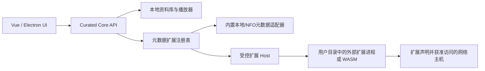

# Curated 合规化与元数据源解耦研究方案

> 状态：proposed（构思方案，尚未批准实施）。
>
> 日期：2026-07-18；最近补充：2026-10-04。
>
> 适用范围：Curated 的公开仓库、安装包、默认运行行为、元数据扩展机制与对外说明。

2026-10-03 阅读入口：**第 15 节「普通电影、电视剧兼容与成人内容隔离」**。本次讨论重新评估在现有项目兼容普通影视的可能性，只形成构思方案，没有新增 PRD requirement、运行配置、API 或数据库迁移。2026-08-14 曾选择 SFW 另建项目，见 [当时的研究与决定](2026-08-14-curated-core-scrape-decoupling-and-optimization.md)；本次讨论不代表已批准改变实施范围。

第 1–14 节保留历史研究背景，其中「当前代码」「当前打包」指当时审计时点，不能直接当成 2026-10-03 的实现事实。例如发布样例配置与安装布局此后已调整。第 15 节区分本轮核对过的实现与拟议设计；所有新增字段、类型和流程均为建议，尚不存在于产品中。

2026-10-04 补充：第 15.13 节细化「安装普通版后，用户通过哪些步骤开启成人区」。建议当前阶段采用本机设置中的一次性配置向导；若普通发行包完全排除成人专有代码，则必须改为额外安装能力模块，不能仅用配置解锁。

同日进一步补充：第 15.14 节具体定义扩展包、导入安装、注册和独立进程调用机制，澄清配置导入、编译期 Go module 与运行期扩展的区别。当前源码尚无该扩展宿主，以下仍为目标设计。

## 1. 结论先行

Curated 可以被改造成一个默认只管理本地媒体、默认不访问任何成人元数据站点、并由用户自行安装元数据扩展的通用媒体资料库。推荐目标不是“把成人用途藏起来”，而是让公开分发的核心应用在代码、二进制、默认配置、示例数据和网络行为上都真正保持中性，并对扩展能力进行显式、可审计的隔离。

仅修改 `library-config.cfg` 中的 provider 列表不构成真正解耦。当前 `metatube-sdk-go v1.3.2` 的 `engine/register.go` 会通过空白导入把约 35 个成人元数据 provider 静态编译进后端；而 Curated 当前的空 provider / 空 chain 还表示“自动使用全部已注册源”。因此：

- 把 provider 名称移出默认配置，可以改善安装包表面与默认选择，但不能移除二进制中的 provider 实现。
- 新增一个默认关闭的配置字段，可以阻止默认联网，但不能单独证明分发包是通用核心。
- 若要达到较强的公开分发边界，必须让公开核心不再依赖或编译 `metatube-sdk-go` 的站点实现，把具体数据源移入用户自行安装的独立扩展包。

推荐最终形态是“Curated Core + 外部元数据扩展”，而不是“同一二进制 + 隐藏开关”。

## 2. 合规边界

本方案是技术与产品风险控制建议，不是针对任何司法辖区的正式法律意见。公开或向朋友分发软件时，仍应单独评估所在地关于淫秽信息传播、未成年人保护、著作权、网站条款、反爬规则、个人信息与软件分发的要求。

需要坚持以下边界：

1. 对外描述应真实：可以称为“本地优先的媒体资料库”，但不应通过虚假截图、虚假功能说明或秘密解锁说明误导审核方、托管平台或用户。
2. “朋友之间分享”不应被假设为天然免责场景。
3. 插件化本身不自动消除责任。如果核心项目官方打包、托管、自动下载、推荐或定向宣传特定成人站点扩展，技术拆分仍可能不构成实质隔离。
4. 不在核心仓库、核心发布页和核心更新通道中附带成人数据源包、站点清单、成人海报、真实番号样例或一键下载链接。
5. 用户导入的本地媒体与扩展配置应默认留在本机，不上传、不遥测、不进入崩溃报告。

## 3. 当前代码事实与风险审计

### 3.1 当前已有的中性基础

- 产品正式名已是 `Curated`。
- `package.json` 的产品描述已是 `Curated — local-first media library (Vue + Go)`。
- UI 主流程本质上可复用于通用媒体：本地资料库、详情、播放、标签、收藏、历史、资料编辑、媒体导入、存储状态与 PIN 保护。
- release 数据已使用 `%LOCALAPPDATA%\Curated` 等用户数据目录，具备承载用户扩展目录的基础。
- 第三方元数据实现已经集中在 `backend/internal/scraper/metatube` 适配层，没有散落到全部业务包；这为后续替换适配器提供了较好边界。

### 3.2 当前明显的公开痕迹

| 层面 | 当前事实 | 风险 |
|---|---|---|
| npm / 仓库标识 | `package.json.name` 仍为 `jav-shadcn` | 包元数据、构建日志和仓库地址会直接暴露用途历史 |
| 前端源码 | `src/components/jav-library`、`src/lib` 的历史命名与多处 `jav-*` localStorage key | 公开源码、DevTools 与浏览器存储中可见 |
| Electron bridge | preload 暴露 `window.javLibrary.pickDirectory()` | 渲染器全局对象直接带有用途标识 |
| UI 文案 | 中文存在“番号”“片商”，路径示例含 `D:\Media\JAV` | 默认界面和截图不完全中性 |
| 网络设置 | UI 与 API 暴露 `/api/proxy/ping-javbus`，并显示“测试 JavBus 连通” | 默认安装可见特定站点能力 |
| 文档 | README、API.md、CLAUDE.md 明示 JavBus、Metatube 成人元数据、特殊番号规则 | 公开仓库用途清晰可见 |
| 测试 / Mock | 测试与 Mock 路径含 `JAV`，provider 名含 JavBus/JavDB 等 | 即使 UI 清理，源码审计仍会发现大量定向样例 |
| 扫描器 | `backend/internal/scanner/number.go` 特化 FC2、Heyzo、Tokyo-Hot 等编号 | 核心代码不是完全通用的媒体文件识别器 |
| 默认配置样例 | `config/library-config.cfg` 当前含 `AVBASE`、`JAV321`、`JavBus` provider chain，并含本机代理设置 | release 会把它复制成 `library-config.example.cfg`，属于直接发布内容 |
| 依赖 / 二进制 | 后端直接依赖 `metatube-sdk-go v1.3.2`，SDK 静态导入全部站点 provider | 即使配置隐藏，核心二进制仍携带站点实现和域名 |

### 3.3 当前默认行为中的关键陷阱

当前 `MetadataMovieProvider == ""`、`MetadataMovieProviderChain == []` 或 `metadataMovieScrapeMode == "auto"` 并不是“禁用元数据”，而是走 `SearchMovieAll`，即自动使用所有已注册 provider。

所以实施中不能简单地清空：

```json
{
  "metadataMovieProvider": "",
  "metadataMovieProviderChain": []
}
```

上述配置在当前实现中反而保留了全源抓取能力。必须引入一个独立于 provider 选择的总策略字段，并让后端在进入任何刮削任务前先执行强制门控。

### 3.4 当前 release 打包泄漏

`scripts/release/release_lib/build_steps.py` 会把仓库根目录的 `config/library-config.cfg` 原样复制到：

```text
resources/app/runtime/config/library-config.example.cfg
```

由于当前开发机配置包含成人 provider chain、代理地址、播放器命令和库 ID，这不仅不适合作为公开样例，也可能意外携带个人环境信息。发布流程应改为复制一个专门维护、可复现、无本机状态的 `config/library-config.example.cfg`，并对 release 内容做敏感字段检查。

## 4. 目标产品定义：默认安全的通用媒体资料库

公开核心应满足以下可验证定义：

- 干净安装后只提供本地文件扫描、通用媒体浏览、播放、标签、备注、收藏、历史、导入、存储管理和安全设置。
- 不内置成人站点 provider，不自动访问任何第三方元数据站点。
- 不使用成人海报、演员、番号、站点名或成人目录作为默认样例。
- 未安装扩展时，元数据页面显示“未安装元数据扩展”，而不是“自动全源”。
- 用户必须自行取得扩展包、自行放入用户数据目录，并在 UI 中显式确认启用及网络权限。
- 核心更新与扩展更新分离；核心官方更新源不返回第三方扩展目录。
- 卸载扩展后，核心仍可完整管理已有本地媒体；只是不能通过该扩展更新外部元数据。

对外可以如实描述为：

> Curated 是一款本地优先的个人媒体资料库，用于整理、浏览和播放用户有权管理的本地媒体。第三方元数据能力由用户自行安装和配置，Curated Core 不附带第三方数据源。

## 5. 推荐架构


```mermaid
flowchart LR
  UI["Vue / Electron UI"] --> API["Curated Core API"]
  API --> Library["本地资料库与播放器"]
  API --> Registry["元数据扩展注册表"]
  Registry --> Local["内置本地/NFO元数据适配器"]
  Registry --> Host["受控扩展 Host"]
  Host --> Plugin["用户目录中的外部扩展进程或 WASM"]
  Plugin --> Site["扩展声明并获准访问的网络主机"]
```

### 5.1 核心内部边界

保留并泛化现有 `scraper.Service` 思路，拆为传输无关接口：

- `MetadataProviderRegistry`：枚举已安装、已启用、可用的 provider。
- `MovieMetadataProvider`：搜索与获取影片元数据。
- `PersonMetadataProvider`：可选的人物资料能力。
- `ProviderHealthChecker`：只检测该扩展在 manifest 中声明的主机与能力。
- `MetadataProviderHost`：启动、限时、停止和隔离外部扩展。

推荐目录：

```text
backend/internal/metadata/
  contracts.go
  registry/
  localnfo/
  sidecar/
  manifest/
```

业务层继续只依赖内部接口，不直接导入扩展 SDK。`backend/internal/scraper/metatube` 应移出公开核心，或仅存在于不随核心发布的独立扩展工程。

### 5.2 为什么推荐 sidecar / WASM，而不是只读 JSON 列表

| 方案 | 能做什么 | 隔离强度 | 结论 |
|---|---|---:|---|
| JSON provider 名称白名单 | 启用核心二进制里已有的 provider | 低 | 只适合短期私有过渡，不适合作为最终公开核心 |
| JSON/YAML CSS 选择器规则 | 表达部分网页刮削逻辑 | 中低 | 规则复杂、易被远程内容利用、难覆盖 JS/鉴权/反爬，不推荐作为首版 |
| 外部 sidecar 可执行文件 + JSON-RPC/stdio | 扩展自行实现站点逻辑，核心仅持有协议 | 高 | Windows / Go 当前架构下最务实的推荐方案 |
| WASM 扩展 | 更容易限制文件和网络权限 | 高 | 长期理想，但宿主网络 API、签名和 SDK 工作量更大 |

关键事实是：一个仅包含名称和 URL 的小文件不能凭空提供完整站点抓取逻辑。如果核心仍能在收到名称后调用特定站点，说明站点实现仍然内置。要实现真正的来源提取，用户放入的内容必须包含扩展代码，或包含足以执行的受限规则；推荐前者。

## 6. 配置设计

### 6.1 小配置字段：总门控，不做秘密解锁

建议在 `library-config.cfg` 新增：

```json
{
  "metadataSourcePolicy": "disabled"
}
```

允许值：

- `disabled`：默认值。禁止启动外部元数据扩展，任何刮削请求返回稳定错误 `METADATA_DISABLED`。
- `user-installed`：允许加载用户扩展目录；如果目录为空，仍然没有可用 provider。

该字段应只控制“是否允许使用用户扩展”，不应单独把任何成人站点变成可用。用户要使用扩展时，必须同时完成：

1. 把完整扩展包放入规定目录；
2. 将 `metadataSourcePolicy` 改为 `user-installed`，或在设置页做等价的显式确认；
3. 在 UI 中逐个启用扩展并确认其网络权限。

现有字段继续负责“已安装扩展中的选择和顺序”：

```json
{
  "metadataSourcePolicy": "user-installed",
  "metadataMovieScrapeMode": "chain",
  "metadataMovieProviderChain": ["example.movie-db"]
}
```

不建议设计未文档化的布尔值、彩蛋、口令或伪装字段。这类机制不利于审计，也容易被解释为故意规避平台规则。

### 6.2 默认配置样例

公开仓库与发布包中的样例应独立于开发机实际配置：

```json
{
  "metadataSourcePolicy": "disabled",
  "metadataMovieScrapeMode": "specified",
  "metadataMovieProvider": "",
  "metadataMovieProviderChain": [],
  "autoActorProfileScrape": false,
  "proxy": {
    "enabled": false,
    "url": ""
  },
  "organizeLibrary": false
}
```

并补充 release 校验，禁止把以下内容复制进公开样例：

- 非空代理地址；
- 本机 library ID、绝对路径、日志路径；
- 已启用的原生播放器命令；
- 特定成人站点名或域名；
- 非空 provider chain。

### 6.3 用户扩展目录

release 默认路径：

```text
%LOCALAPPDATA%\Curated\extensions\metadata-providers\
  example.movie-db\
    manifest.json
    provider.exe
    LICENSES.txt
```

跨平台路径跟随现有 `curatedDataRoot()`：

- Windows：`%LOCALAPPDATA%\Curated\extensions\metadata-providers`
- macOS：Curated 用户配置根目录下的 `extensions/metadata-providers`
- Linux：`$XDG_DATA_HOME/curated/extensions/metadata-providers` 或 `~/.local/share/curated/...`
- 开发态：建议放在 `.workspace/curated-data/extensions/metadata-providers`，避免继续向仓库根新增运行时目录。

可保留 `CURATED_DATA_DIR` 覆盖，从而让便携版用户明确选择扩展目录。

## 7. 扩展包格式

### 7.1 Manifest 示例

公开核心只提供中性示例，不提供真实成人站点 manifest：

```json
{
  "schemaVersion": 1,
  "id": "example.movie-db",
  "displayName": "Example Movie Database",
  "version": "1.0.0",
  "protocol": "curated.metadata.v1",
  "entrypoint": "provider.exe",
  "capabilities": ["movie.search", "movie.details", "provider.health"],
  "permissions": {
    "networkHosts": ["metadata.example.org"],
    "readLibraryFiles": false,
    "writeLibraryFiles": false
  },
  "integrity": {
    "algorithm": "sha256",
    "entrypoint": "<hex digest>"
  }
}
```

### 7.2 必须校验

- `id` 只允许小写 ASCII、数字、点和连字符，且不能形成路径穿越。
- `entrypoint` 必须解析在当前扩展目录内；拒绝绝对路径、`..`、符号链接逃逸。
- `protocol` 与核心支持版本必须匹配。
- 扩展声明的网络 host 使用精确主机或受控子域规则，不能默认 `*`。
- 核心把 library path、代理、PIN、数据库路径等敏感数据视为不可见；只发送完成请求所需的最小 DTO。
- 每个请求有 deadline、最大响应体、并发上限和进程退出策略。
- 扩展 stdout 只允许协议帧，stderr 进入独立、脱敏日志。
- 首版至少校验 SHA-256；正式分发建议增加作者签名与信任提示，但不能把“签名有效”误写成“内容合规”。

### 7.3 建议协议

使用换行分隔 JSON-RPC 2.0 或等价的长度前缀 JSON，通过 stdio 通信：

```text
provider.initialize
provider.capabilities
movie.search
movie.details
person.search
person.details
provider.health
provider.shutdown
```

长任务仍通过 Curated 现有 task 系统返回 `taskId` 和进度；扩展协议不直接暴露数据库模型或前端组件模型。

建议新增稳定错误码：

- `METADATA_DISABLED`
- `METADATA_EXTENSION_NOT_FOUND`
- `METADATA_EXTENSION_INVALID_MANIFEST`
- `METADATA_EXTENSION_UNTRUSTED`
- `METADATA_EXTENSION_PROTOCOL_MISMATCH`
- `METADATA_EXTENSION_PERMISSION_DENIED`
- `METADATA_EXTENSION_TIMEOUT`
- `METADATA_EXTENSION_CRASHED`
- `METADATA_PROVIDER_EMPTY_RESULT`

## 8. API 与 UI 调整

### 8.1 API 中性化

推荐逐步废弃站点专用 API：

- 废弃 `POST /api/proxy/ping-javbus`。
- 保留通用网络诊断，但不要提供可被任意 URL 利用的 SSRF 接口。
- provider 健康检查只接受已安装的 provider ID，由后端根据 manifest 中的 host 权限执行。
- `GET /api/settings` 增加 `metadataSourcePolicy`、已安装扩展摘要和加载错误摘要。
- `POST /api/providers/reload` 只重新扫描用户扩展目录，不联网下载任何扩展。

建议 provider DTO 增加：

```text
id, displayName, version, origin, enabled, capabilities,
declaredHosts, trustState, healthStatus, lastError
```

其中 `origin` 至少区分 `core`、`user-extension`，UI 不再假设 provider 都来自 Metatube。

### 8.2 默认 UI

未安装扩展时，元数据设置页显示：

- 状态：“未安装元数据扩展”；
- 说明：“Curated Core 默认不附带第三方数据源。你可以从本机导入自己信任且有权使用的扩展包。”；
- 操作：“打开扩展目录”“重新扫描”；
- 不显示任何站点名、成人样例或“自动全源”。

安装扩展后：

- 显示扩展来源、版本、权限主机、校验状态和启用开关；
- 第一次启用前弹出权限确认；
- provider chain 只列出已安装且已启用的扩展；
- 删除扩展只停止后续抓取，不删除已经写入用户资料库的元数据，除非用户另行执行清理。

设置页实现继续遵循现有 `SettingsMetadataSection` 的 Card / nested block 规范，并通过 `useLibraryService()` 与服务合约取数。

## 9. “表面正常化”应改为“产品中性化”

### 9.1 发布包必须优先清理

1. 将 `package.json.name` 迁移为中性包 ID，例如 `curated-desktop`；确认锁文件与 release 脚本影响。
2. 将 Electron preload 新 API 改为 `window.curated.pickDirectory()`；为一个迁移版本保留旧 alias，但生产构建可不再暴露旧名。
3. 把默认 UI 的“番号”改为“媒体编号”或“作品编号”，“片商”改为“制作方/发行方”。
4. 所有路径示例改为 `D:\Media\Movies`、`/Users/you/Movies` 等通用示例。
5. 删除 JavBus 专用连通性按钮与 API，改为已安装扩展自己的健康状态。
6. Mock 数据只用虚构标题、人物、制作方、编号和本地占位图；不能从真实成人数据导出。
7. 默认隐藏“演员资料自动抓取”等依赖扩展的选项；无扩展时保持禁用并解释原因。
8. release 不复制开发机 `library-config.cfg`，只复制受版本控制的纯净 example。

### 9.2 公开源码需要进一步清理

如果目标是公开仓库，而不仅是分享安装包，还需要逐步迁移：

- `src/components/jav-library` → `src/components/media-library`；
- `window.javLibrary` → `window.curated`；
- `jav-library-*` localStorage key → `curated-*`，带一次性兼容迁移；
- 测试路径和 fixture 改为通用媒体路径；
- `backend/internal/scanner/number.go` 中成人站点/编号专用规则移入扩展；核心仅保留通用文件名 token、NFO、文件夹与用户正则规则；
- README、API.md、CLAUDE.md、`.cursor/rules` 与产品设计文档中的历史用途说明重新分层；公开核心只记录真实存在的中性能力。

公开源码不建议只做大规模字符串替换。目录名、存储 key、API 与迁移兼容应按最小修改单元分批完成，避免破坏现有用户数据。

### 9.3 仓库策略

可选方案：

| 策略 | 优点 | 缺点 | 建议 |
|---|---|---|---|
| 继续单仓库，使用 build tag | 维护成本较低 | 成人 provider 代码和历史仍在公开仓库，核心边界不清晰 | 不推荐作为公开核心最终形态 |
| 新建 `curated-core` 公开仓库，当前仓库保留私有迁移历史 | 公开内容最清晰、容易审计 | 需要同步迁移和维护扩展协议 | 推荐 |
| 单仓库移除 provider 并保留完整历史 | 当前 issue/commit 连续 | Git 历史仍可搜索旧内容 | 可用于技术透明，但不适合把目标理解为“抹除历史” |

如果创建新的公开核心仓库，应保留所有第三方许可证、版权声明与必要归属；不能以“合规化”为由删除许可证义务。也不建议为了掩盖历史用途而进行误导性的历史改写。

## 10. 分阶段实施路线

### P0：立即止血（1～2 天）

- 新建纯净 `config/library-config.example.cfg`，release 只复制该文件。
- 清空公开样例中的 provider、代理、本机路径、播放器命令和 library ID。
- 引入 `metadataSourcePolicy=disabled`，在任务入口做硬门控。
- 干净安装默认不自动抓取人物或影片元数据。
- 删除 UI 中 JavBus 专用连通性入口，或在迁移期仅当私有构建明确启用时显示。
- 为打包产物增加敏感字符串和敏感配置检查。

P0 只能保证默认行为和安装包样例更安全，不能移除二进制里的 Metatube provider。

### P1：产品与源码中性化（3～7 天）

- 更新 UI 术语、路径示例、Mock、截图、README 与 package 元数据。
- 迁移 Electron bridge 和 localStorage key，保留一次兼容读取。
- 把站点专用网络 API 改成扩展级健康检查。
- 无扩展时提供完整可用的本地媒体体验与清晰空状态。
- 建立自动化公开痕迹扫描白名单；白名单只允许许可证、迁移说明等必要位置。

### P2：运行时白名单过渡（4～7 天）

- 实现用户目录 `sources.json` 或 manifest 扫描。
- 初始化引擎时仅允许 manifest 选中的 provider；其他 provider 的 priority 设为 0。
- `auto-global` 只能作用于用户明确启用的 provider 集合。
- 配置升级后不自动激活旧 chain，要求用户确认。

P2 仍把 provider 代码编译进二进制，只适合私有过渡、验证 UI 和迁移逻辑，不能作为“核心不含成人源”的完成标准。

### P3：真正拆分扩展（2～4 周）

- 定义 `curated.metadata.v1` 协议与 manifest schema。
- 实现 sidecar host、超时、并发、路径与权限校验。
- 实现内置 `local/NFO` 通用 provider。
- 把 Metatube 适配器迁出核心，核心 `go.mod` 删除 `metatube-sdk-go`。
- 用户扩展包独立构建、独立版本、独立许可证与独立发布边界。
- 完成扩展安装、重载、启停、升级和故障降级测试。

### P4：发布治理（2～5 天）

- 对安装包生成 SBOM 与第三方许可证清单。
- 对二进制、前端 bundle、示例配置、README-release 做敏感字符串检查。
- 干净虚拟机抓取首次启动网络流量，证明核心不会访问第三方元数据站点。
- 准备隐私说明、内容与权利声明、扩展风险说明、漏洞报告入口。
- 根据实际分发渠道单独检查平台条款、年龄分级和地区法律要求。

## 11. 既有安装升级、迁移与兼容策略

### 11.1 兼容目标

合规核心升级不应要求普通用户手工建立目录、编辑 JSON、复制多个文件或重新扫描整个资料库。目标体验是：

- 安装新版本后，原有媒体库、元数据、图片缓存、资料库路径、标签、收藏、评分、评论、播放历史、PIN、播放器与日志设置自动保留。
- 用户选择“继续仅使用本地资料库”时，只需一次确认，不需要安装任何扩展。
- 用户希望继续使用第三方元数据时，最多执行“选择一个扩展包 + 确认权限”两步；应用自动完成解包、校验、安装、旧 provider chain 映射与配置写入。
- 手工修改 `library-config.cfg` 和手工复制扩展目录仅作为高级用户入口，不是主升级流程。

无法做到完全无确认地继续旧站点抓取：如果新核心自动携带、提取、下载或静默启用旧 provider 代码，就会重新破坏“核心与第三方数据源实质隔离”的目标。这个一次性确认是有意保留的信任边界，不是技术缺陷。

### 11.2 当前架构对原位升级的有利条件

当前代码已经具备较好的基础：

- Windows Inno Setup 使用固定 `AppId`：`{8C9E9E66-7058-4D09-9F9A-8AFD060A7E1B}`，默认安装目录稳定为 `{autopf}\Curated`，可以识别并覆盖升级同一产品。
- 安装器配置了 `CloseApplications=yes`，会在覆盖 `Curated.exe` / `curated.exe` 前关闭旧进程，避免后端与 SQLite 仍占用。
- release 用户数据不在安装目录，而在 `%LOCALAPPDATA%\Curated`（或 `CURATED_DATA_DIR` 指定位置）；覆盖安装默认不会删除用户数据库、配置、缓存和日志。
- SQLite 已通过 `schema_migrations` 按文件名顺序运行内嵌 SQL，并在事务中提交单个 migration，适合增加迁移状态表或字段。
- `library-config.cfg` 的写入使用读取—合并—原子替换，未知字段能够保留，适合逐步引入 `metadataSourcePolicy` 和 migration state。

实施兼容版本时必须保持以下身份稳定：

- 不修改 Inno Setup `AppId`；
- 不修改 `%LOCALAPPDATA%\Curated` 数据根；
- 不把数据库或配置迁回安装目录；
- 不同时改变 Electron 生产 UI 的 origin，否则浏览器 localStorage / IndexedDB 会被视为另一套数据；
- 如果修改 npm package ID、源码目录或 preload namespace，不应连带改变安装器产品身份和用户数据目录。

### 11.3 数据分类与自动迁移范围

| 现有数据 | 升级行为 | 用户操作 |
|---|---|---|
| SQLite 影片、人物、媒体资产、标签、评论、播放记录 | 原库原位迁移；只做 additive SQL migration | 无 |
| 封面、缩略图、预览图、播放缓存 | 保留原路径，不重新下载；失效缓存继续按现有策略修复 | 无 |
| 资料库路径与存储绑定 | 原样保留并重新检查在线状态 | 无 |
| PIN、日志、代理、播放器、自动启动等设置 | 原样保留；只有与外部元数据直接相关的自动化开关需要重新确认 | 无或一次确认 |
| Mock 模式 localStorage 收藏、评分、评论、快捷键、进度 | 一次性复制到新 `curated-*` key；兼容期保留旧 key | 无 |
| IndexedDB 萃取帧 | 保持相同 origin 和数据库名；后续另做版本化迁移 | 无 |
| 已抓取的 provider 名和外部 ID | 作为历史来源字符串保留，不因扩展缺失删除 | 无 |
| 旧 provider chain | 保存为待迁移快照，不自动联网 | 安装扩展后一次确认 |
| 正在运行或排队的旧抓取任务 | 升级关停时中断；新版本不自动恢复，避免未确认扩展就联网 | 需要时重新发起 |

既有海报、简介、演员、制作方等已经落库的元数据属于用户本地资料库的一部分。即使未安装任何扩展，新版本也应继续正常展示；“扩展不可用”只影响后续搜索与刷新，不应让旧影片变成空白。

### 11.4 首次启动迁移器

新增独立、幂等的迁移步骤，例如 `metadata-extension-migration-v1`：

1. 在打开数据库并写入新 schema 前，创建一次只包含配置与 SQLite 的迁移备份；不复制大型媒体文件和可重建缓存。
2. SQLite 备份必须使用安全的 SQLite backup / `VACUUM INTO` 或在数据库尚未打开时复制，不能在数据库写入过程中直接复制文件。
3. 读取旧 `metadataMovieProvider`、`metadataMovieProviderChain`、`metadataMovieScrapeMode`、`metadataMovieStrategy` 与 `autoActorProfileScrape`。
4. 将旧选择写入本地 migration snapshot，例如：

   ```json
   {
     "metadataMigration": {
       "version": 1,
       "status": "pending-user-choice",
       "legacyProvider": "<existing value>",
       "legacyProviderChain": ["<existing values>"],
       "migratedAt": "<local ISO timestamp>"
     }
   }
   ```

5. 写入 `metadataSourcePolicy: "disabled"`，同时关闭 `autoActorProfileScrape`，确保首次启动不会产生第三方元数据流量。
6. 不删除旧字段，直到用户完成扩展映射；迁移完成后也可保留只读快照用于诊断。
7. 迁移状态写入成功后再标记 migration 完成；重复启动不会重复备份或重复弹窗。
8. 全部迁移记录只保存在本机，不进入更新检查、遥测或崩溃上报。

迁移失败时应停止进入可能写入资料库的业务流程，显示“迁移未完成，可重试或从备份恢复”；不能回退到旧的自动全源语义继续运行。

### 11.5 首次升级向导

升级后的第一次启动显示一次中性的迁移页，而不是要求用户去文件系统操作：

```text
你的 Curated 资料库已保留

新版把第三方元数据源改为独立扩展。已有影片、封面、标签、
评论和播放记录不受影响。

[继续使用本地资料库]  [导入元数据扩展包]
```

路径 A——继续使用本地资料库：

1. 用户点击一次“继续使用本地资料库”。
2. 保持 `metadataSourcePolicy=disabled`。
3. 旧元数据继续展示，扫描、整理、播放、收藏等功能立即可用。
4. 设置页保留“导入扩展包”入口，用户以后随时可以处理。

路径 B——继续使用第三方元数据：

1. 用户选择一个 `.curated-extension` 文件，或把它拖进导入区。
2. 应用在 staging 目录解包，校验 manifest、entrypoint 路径、hash、协议版本和签名状态。
3. UI 显示扩展名称、版本、声明 host、文件权限与信任状态。
4. 用户点击一次“安装并启用”。
5. 应用原子移动到扩展目录，写入 `metadataSourcePolicy=user-installed`。
6. 应用根据扩展 manifest 的 `legacyProviderAliases` 自动映射旧 chain；能全部映射时不要求用户重新排序，部分无法映射时只提示缺失项。
7. 完成后重新扫描扩展注册表，不要求重装应用或重启电脑。

`legacyProviderAliases` 由扩展包自己声明，核心不硬编码成人站点名称。例如：

```json
{
  "id": "third-party.example",
  "legacyProviderAliases": ["<legacy provider id>"]
}
```

这样核心可以使用通用字符串映射旧配置，而不需要维护特定站点清单。

### 11.6 过渡版本，避免现有用户跨越式升级

推荐在彻底移除 Metatube 前发布一个“桥接版本”：

1. 桥接版本先引入 `metadataSourcePolicy`、扩展 Host、扩展导入 UI、迁移状态和旧 key 兼容读取。
2. 桥接版本仍可读取现有资料库，但首次启动先要求用户选择本地模式或安装外部扩展；不再默认全源联网。
3. 用户安装扩展后，桥接版本验证新协议能够替代原 provider 行为。
4. 下一主版本再从核心 `go.mod` 和二进制中移除 Metatube。

已经经过桥接版本并完成扩展安装的用户，升级到纯 Core 版本时可以完全无感；扩展目录和 policy 已经存在，只需正常覆盖安装。

如果用户从很旧的版本直接升级到纯 Core 版本，仍走 11.5 的升级向导，最多需要选择一次扩展包，不要求先逐个安装所有中间版本。

核心更新服务不应为了省掉这一步而自动下载第三方 provider。若私有部署确实需要管理扩展，可以配置一个与公开 Core 更新通道分离、由部署者负责的扩展包来源；公开发行物和公开更新 manifest 不附带该来源。

### 11.7 安装器与文件清理

覆盖安装只替换同名文件，不一定自动删除旧版本中已经取消的额外文件。迁移版本应在 Inno Setup 中维护精确的 obsolete-file 清单：

- 只删除安装目录内由旧版本确定性创建的已废弃程序文件；
- 不递归删除 `%LOCALAPPDATA%\Curated`；
- 不删除 `extensions/metadata-providers`、数据库、配置、缓存、日志和用户媒体；
- 删除前按绝对路径和允许列表校验，不能使用宽泛通配符清理用户目录。

当前 Metatube provider 编译在 `resources/app/curated.exe` 中，升级时新后端会覆盖旧后端，不需要从安装目录提取或删除独立 provider 文件。也不能尝试从旧 `curated.exe` 自动“抽取”为扩展；它不是可安全、可验证的独立插件格式。

### 11.8 回滚与降级

升级前必须生成可识别的备份：

```text
%LOCALAPPDATA%\Curated\backups\pre-metadata-extension-v1-<timestamp>\
  library-config.cfg
  curated.db
  migration.json
```

需要特别说明：旧版本不认识 `metadataSourcePolicy`，而且空 provider 在旧版本中可能重新解释为“自动全源”。因此不能承诺安装旧版本后仍自动保持新策略。推荐规则是：

- 新版本内部支持从上述备份恢复；
- 用户选择降级时，先由新版本导出/恢复兼容备份，再安装旧版本；
- 纯 Core 迁移后的直接二进制降级标记为不支持，避免旧版忽略门控字段后意外联网；
- 数据库迁移尽量采用 additive schema，不重命名或删除旧列；破坏性迁移延后到兼容窗口结束。

### 11.9 localStorage 与前端命名迁移

localStorage key 采用“新 key 不存在时读取旧 key，校验后写入新 key”的一次性方式：

1. 迁移收藏、评分、评论、快捷键和播放进度。
2. 新旧 key 同时存在时以新 key 为准，不反复覆盖用户的新选择。
3. 兼容至少两个稳定版本后才删除旧 key；删除动作与迁移实现分开提交。
4. 保持 Electron 生产 origin 不变，避免 localStorage 和 IndexedDB 因 origin 改变而整体不可见。
5. 每个 key 迁移独立失败、独立记录，单项损坏不能阻止应用启动。

### 11.10 升级兼容验收矩阵

至少覆盖以下真实升级路径：

| 来源版本 / 状态 | 目标版本 | 预期结果 |
|---|---|---|
| 旧安装版，有数据库和 provider chain | 桥接版 | 数据全保留；首次向导；默认不联网 |
| 旧安装版，无 provider 设置 | 桥接版 | 数据全保留；可一键进入本地模式 |
| 桥接版，已安装扩展 | 纯 Core | 无感升级；扩展继续可用 |
| 很旧安装版，跳过桥接版 | 纯 Core | 自动迁移数据；要求一次导入扩展或选择本地模式 |
| Mock 用户，只有 localStorage / IndexedDB | 新版 | key 自动迁移，收藏/评分/评论/萃取帧不丢失 |
| 使用 `CURATED_DATA_DIR` | 新版 | 继续使用原覆盖目录，不生成第二套空资料库 |
| 便携 ZIP 覆盖升级 | 新版 | 识别同一数据根；不覆盖用户扩展与配置 |
| 扩展包无效或 hash 不匹配 | 新版 | 拒绝安装；本地资料库继续可用 |
| 首次迁移中途断电/崩溃 | 重新启动 | 幂等重试；原数据库或备份可恢复 |
| 从新 Core 直接安装旧版 | 旧版 | 明确阻止/警告，要求走备份恢复流程 |

最终 UX 验收不是“高级用户按照文档可以迁移成功”，而是“普通旧用户正常点击升级后，资料库立即可用；不需要第三方元数据时零配置，需要时只导入一个扩展包并确认一次”。

## 12. 验收标准

### 12.1 干净安装

- 首次启动不访问任何第三方元数据域名。
- 未安装扩展时 provider 列表为空，元数据任务返回 `METADATA_DISABLED` 或 `METADATA_EXTENSION_NOT_FOUND`。
- 本地扫描、浏览、播放、标签、备注、收藏、历史和导入仍可使用。
- 默认 UI、Mock、路径示例和截图不出现成人站点名、成人图片或成人专用术语。

### 12.2 发布物静态审计

- 核心 `go.mod`、SBOM 和二进制不包含 `metatube-sdk-go`。
- 对 `Curated.exe`、`resources/app/curated.exe`、前端 bundle 和 example config 做字符串扫描，不包含已定义的站点名与成人样例词。
- release 包不包含真实 `library-config.cfg`、数据库、日志、缓存、用户路径、代理或扩展包。
- 所有第三方许可证与 NOTICE 完整。

### 12.3 扩展安全

- manifest 路径穿越、绝对 entrypoint、越界符号链接和 hash 不匹配均被拒绝。
- 扩展不能读取数据库、PIN、全部 library path 或任意文件，除非协议为具体能力明确授权。
- 未声明 host 的网络请求被阻止或在受控宿主中无法发起。
- 超时、崩溃、超大响应、乱码 stdout 不会拖垮核心进程。
- 删除或禁用扩展后不再产生外部网络请求。

### 12.4 对外信息

- 产品描述准确说明“本地媒体资料库”和“第三方扩展由用户自行安装”。
- 不通过隐晦文案、暗号、隐藏字段或定向链接规避平台审核。
- 隐私、许可证、扩展权限、内容责任与反馈渠道在发布页可见。

## 13. 建议的最小修改单元

后续实施建议按以下原子提交切分：

1. `docs: add compliance and metadata extension architecture`
2. `build: package a sanitized library config example`
3. `feat(config): add disabled-by-default metadata source policy`
4. `feat(metadata): enforce metadata policy at task boundaries`
5. `refactor(api): replace site-specific proxy probe with provider health`
6. `refactor(ui): neutralize metadata copy and path examples`
7. `refactor(electron): migrate preload namespace to window.curated`
8. `refactor(storage): migrate legacy jav localStorage keys`
9. `feat(metadata): add user extension manifest registry`
10. `feat(metadata): add sidecar protocol host`
11. `refactor(metadata): move Metatube adapter out of Curated Core`
12. `test(release): audit clean-install network and sensitive strings`
13. `docs: publish extension, privacy, license, and distribution guidance`

每个实现提交应自带对应测试；文档同步应根据实际 API 和目录变更更新 `.cursor/rules/project-facts.mdc`、`workspace-quick-reference.mdc`、README 多语言版本、`API.md`、`CLAUDE.md` 与架构说明。

## 14. 最终建议

若目标只是把安装包发给少量朋友，P0 + P1 可以迅速降低默认暴露和误操作风险，但不应把它称为完成了强合规隔离。若目标是公开宣传、公开仓库或公开下载，建议至少完成 P3：公开核心不包含 Metatube 和任何成人站点 provider，用户扩展目录为空时也不存在可被一个字段直接唤醒的内置站点能力。

最稳妥的产品叙事不是“看起来正常，但可以秘密变回 JAV 工具”，而是“它本来就是一个通用、本地优先的媒体资料库；用户可在自己的责任与权限范围内安装第三方元数据扩展”。这两种实现从静态审计、默认网络行为、平台沟通和长期维护角度都有实质差别。

## 15. 普通电影、电视剧兼容与成人内容隔离（2026-10-03）

### 15.1 本轮问题与已核对的实现

用户希望 Curated 支持普通电影和电视剧，同时与现有特殊影片分离；优先讨论启用配置、默认状态和代码层面的内容隐藏。当前处于构思阶段。

本轮从源码核对的事实：

| 位置 | 当前实现 | 对方案的影响 |
| --- | --- | --- |
| `src/domain/movie/types.ts` | `Movie` 必含 `code`、单个 `location`，没有剧、季、集关系或内容分区字段 | 普通影视不能只换展示文案；需要扩展作品与播放单元的关系 |
| `backend/internal/scanner/service.go`、`number.go` | 文件扫描调用番号识别；无匹配标为 `number_not_recognized` 并跳过 | 普通片名、`S01E02` 等需要另一套识别策略；不能把全部文件先交给番号规则 |
| `backend/internal/storage/scan_repository.go` | 扫描按编号查重，首次写入用编号生成存储 ID | 普通影视需要稳定内部 ID；外部编号只作为可选标识 |
| `backend/internal/storage/library_repository.go` | 列表和计数共用查询条件，现有记录围绕 `movies` 与单个路径读取 | 未来内容范围必须在分页与计数前加入同一查询条件 |
| `src/router/index.ts`、`AppSidebar.vue` | 漫画、写真各有启用开关；路由与侧栏读取对应服务 | 可以借鉴能力门控，但媒体格式开关不能替代内容隔离 |
| `src/services/library-service.ts` | Web 模式选中服务时会启动资料库加载 | 内容策略必须先确定，再加载内容；只在页面渲染时判断会太晚 |
| `backend/go.mod`、`internal/scraper/metatube/service.go` | 仍直接依赖 Metatube，存在 `SearchMovieAll` 路径；空源配置不等于禁用抓取 | 成人元数据需独立总门控；不能靠清空 provider 达到关闭目的 |
| 现有 Server/Desktop 边界 | Server 保存资料库与全局配置，Desktop 负责连接；远端全局设置写入被限制 | 成人能力由 Server 管理，客户端仅选择当前可访问的分区 |

此前的全局 PIN 保护不是成人分区权限系统，现有播放列表也不是剧集数据模型。两者可以复用部分实现，不能直接认为已满足新需求。

### 15.2 建议产品结构：共享基础能力，按资料库分开

推荐同一应用中支持多个明确分区的资料库：普通电影库、电视剧库、成人影片库。浏览时进入其中一个内容范围；首页、搜索、人物和历史随当前范围变化。普通电影和电视剧可以共享普通影视首页，成人范围使用独立入口。

共享播放器、文件探测、导入传输、收藏、评分、备注、任务和存储管理；识别器、元数据源、详情中的专有字段与内容策略分别实现。初期不要求拆成不同数据库或维护两套播放器，也不建议增加默认混合全部内容的首页。

必须区分三个维度：

| 维度 | 回答的问题 | 建议表示 |
| --- | --- | --- |
| 作品结构 | 是单部电影还是连续剧？ | `kind = movie / series`；电视剧另有季、集 |
| 内容归属 | 属于普通影视、成人内容，还是尚未确认？ | `contentClass = general / adult / unknown` |
| 整理策略 | 如何识别文件、匹配元数据和展示专有信息？ | 资料库选择普通电影、电视剧或现有成人编号策略 |

成人作品也可能有系列或多集；成人编号不能作为第三种作品结构去排斥电影/剧集关系。漫画和写真是媒体格式，也可能包含成人内容，应执行同样的内容策略。

这里的 `general` 表示普通影视范围，并不承诺适合所有年龄。普通影视中的成熟题材和各地区年龄分级，后续可另设 `contentRating`；不能把普通影视来源当成逐帧 SFW 检测结果。

### 15.3 配置：Server 允许、资料库归属、会话进入

建议保持三个层次，各自回答一个问题。

**一、Server 是否启用成人内容能力。** 新增一个明确的持久化开关，候选名称：

```json
{
  "adultContentEnabled": false
}
```

保存到 Server 的 `library-config.cfg`，使用既有本机设置管理边界。默认关闭；通过本机设置中的「启用成人内容」显式打开。它控制成人入口、专有识别/元数据能力和成人内容访问，不删除数据。无需每次启动重新填写，也不使用 `VITE_USE_WEB_API` 或某个 provider 是否非空来推导状态。

这个示例字段尚未实现。打开开关只表示允许使用成人区，不代表已经导入成人作品、配置可用元数据源，或让所有客户端立即显示成人内容。

**二、每个资料库的归属与整理策略。** 创建资料库时明确选择普通电影、电视剧或成人影片；选择目录后，系统保存该库的内容归属与识别策略。用户要恢复现有使用方式，只需启用成人能力、建立或确认成人库，再进入该库；现有元数据源配置作为成人库中的可选补充。

首次配置由用户明确指定目录归属，不根据 `JAV` 等路径字符串、是否识别出番号或元数据站点名偷偷切换全局状态。普通电影即使没有在线元数据，也应能入库和播放。

**三、当前客户端/会话正在浏览什么。** 当前范围候选名称为 `activeContentScope`，由服务端结合能力和会话状态确定。默认进入普通影视范围；启用成人能力后，用户显式进入成人区。某台设备切换范围不应连带其他设备切换。

如果需要「他人不能进入成人区」的保护，应另行定义成人区解锁/授权策略。现有全应用 PIN 只能保护整个应用，不能宣称已经提供了分区授权。客户端提交 `scope=adult` 不能绕过服务端未启用或未授权的状态。

「下次启动自动进入成人区」可作为之后的本设备显式偏好，首版建议默认不记忆成人入口；不能把它当成 Server 对所有设备的默认值。

### 15.4 默认状态与启动顺序

| 状态 | 建议表现 |
| --- | --- |
| 全新安装，无内容策略 | 普通影视范围，成人能力关闭；未分类数据不作为普通内容显示 |
| 普通库为空 | 显示添加电影/电视剧资料库的中性空状态，不展示成人 Mock 样例或已有成人海报 |
| 已启用成人能力，重新打开应用 | 仍先进入普通影视范围，可显式进入成人区 |
| 成人区启用，但无可用成人元数据源 | 可以浏览本地已导入媒体；成人联网抓取不启动，明确显示未配置 |
| 内容策略读取失败、值无效或尚未返回 | 只显示中性应用壳层；不加载成人内容和未分类图片，不回退到成人模式 |
| 旧用户升级，尚未确认内容策略 | 数据保留，先做一次分区确认；不直接打开旧海报墙或把旧数据当成普通影视 |

建议启动顺序：连接 Server → 确认现有身份/锁定状态 → 读取内容能力与本会话范围 → 校验恢复路由 → 加载该范围的资料库和图片。

后端启动或恢复任务时也要先读取策略：在成人能力未启用前，不启动成人库监听、成人元数据抓取、人物自动补全或相关 AI 后台任务。该限制与普通资料库的正常扫描分别处理。

旧窗口恢复到成人详情/播放器、URL 带成人 ID、历史路由指向成人页时，都要先通过当前策略。恢复失败回到普通入口；不能先展示一帧旧内容再跳走。

### 15.5 内容分类与数据隔离

起步可以共用 SQLite，但每个作品都要有明确资料库归属和有效内容分类。服务端所有读取依赖统一的内容范围策略；仅在前端增加 `isAdult` 筛选不足以构成隔离。

建议分类规则：

1. 用户显式建立的成人库默认归入成人范围。
2. 用户显式建立的普通库按该库归属处理；识别到成人来源标记或用户手动标记的条目转为成人/待确认，不能仅凭普通库归属把已知成人标记降级。
3. 旧数据、混合目录、无法确认归属的导入先进入 `unknown`；普通范围不展示，设置中只提供中性的待分类提示。
4. 番号、文件名、来源和模型识别可提供建议，不能保证判断全部正确。尤其不能把「没有识别出成人编号」推导成普通内容。

标签、人物、愿望单条目、截图、GIF、萃取帧、播放进度和 AI 结果，都要能追溯到作品或独立的内容分类。无明确归属的图片和产物按未知内容处理。

人物身份应使用内部 ID 与带来源的外部标识，不能只按同名全局合并；标签名称、标签计数和人物作品数只来自当前可见范围，避免泄露隐藏库的词汇或关联。普通影视演员功能可以保留，隔离的是成人资料和关联作品。

### 15.6 电视剧：作品、季、集、播放文件分别建模

推荐目标关系：

```text
电视剧作品
  ├─ 第 1 季
  │   ├─ 第 1 集 → 播放文件
  │   └─ 第 2 集 → 播放文件
  ├─ 第 2 季
  │   └─ 第 1 集 → 播放文件
  └─ 特别篇（可使用第 0 季）

电影作品 → 播放单元 → 播放文件
```

电影首版只有一个播放单元；普通影视和成人作品都使用稳定内部 ID。外部标识保存为「来源 + 类型 + ID」，支持无编号电影、同名不同年份电影和后续手工匹配。当前番号保留为成人作品的可选领域标识，不再是通用身份的前提。

各层承担不同的信息：

- 作品：标题、简介、整体海报、人物、用户收藏/评分、内容分类。
- 季：季序号、可选季名与季海报。
- 集：集序号、集名、简介、时长和独立观看状态。
- 播放文件：位置、编码、分辨率、字幕等；不能用文件版本或分段编号冒充集号。

用户在资料库中看到一张「某部剧」卡片；详情选择季和集，主要操作是「继续观看第 X 集」。播放进度按集/播放单元保存，再汇总为剧的进度；自动下一集按季、集顺序生成，不套用资料库评分或添加时间排序。

已有播放器、队列窗口、HLS 和 Picture-in-Picture 可以复用；需要扩展其 ID、路由、历史和队列来源。剧集目录关系必须持久化，不能只保存成一份临时播放列表。

首版可限制为每集一个文件，先支持标准 `S01E02`、明确季目录与手工修正。多版本、单集多文件、一个文件含多集、绝对集号、复杂特别篇编排可分期；识别不确定时保留文件并允许修正，不直接错误合并。稳定作品/集 ID 与分层关系应先确定，以免以后再迁移观看历史。

### 15.7 后端：不在响应之后过滤

建议把有效策略统一为：Server 已启用的能力 ∩ 会话可访问范围 ∩ 当前选择的资料库范围。请求中的筛选条件只能进一步缩小范围，不能增权。

所有内容读取入口都执行这条策略：

| 入口 | 隔离要求 |
| --- | --- |
| 列表、搜索、推荐、收藏、历史、回收站、统计、导出 | 先按范围查询，再计数、排序、分页与聚合；不能先返回全量数据再过滤 |
| 作品/集详情、人物、标签、愿望单 | 按 ID 访问同样判断归属；隐藏名称、简介、关联和计数 |
| 海报、头像、缩略图、预览、截图、GIF、萃取帧 | URL 对应资源必须关联可访问作品；不能让静态目录绕过内容策略 |
| 视频流、HLS、字幕、外部播放器启动 | 创建与使用播放会话时均校验；旧播放 URL 不能在退出成人范围后继续获取内容 |
| Agent 工具、来源检索、聊天历史、保存视图、通知、SSE | 查询、事实上下文、输出和恢复历史均按范围隔离；提示词不能代替权限检查 |
| 扫描、导入、抓取与后台任务 | 入库先确定归属；关闭成人能力后取消/停止相关任务并阻止旧任务发布结果 |

直接按隐藏 ID 访问时，应统一返回不泄露作品是否存在的不可访问结果，具体错误契约在实施时确定。禁止先查到成人内容，再把图片 URL 或标题放进普通模式错误信息。

成年内容源与普通影视元数据源分别注册和调度。任何空 provider、自动 fallback、旧缓存或后台重试都不能跨分区调用成人来源。是否允许在线元数据请求由独立来源策略决定；默认建议先提供本地文件/NFO 能力，再由用户选择普通影视在线来源。

多客户端场景还要区分「某台客户端退出成人区」和「Server 全局关闭成人能力」：前者只撤销该会话对应的媒体访问，后者影响全部会话和后台任务。

### 15.8 前端：统一入口策略与清理已有内容

UI 使用统一内容能力/范围服务，在导航、路由、搜索、导入、设置、人物、首页和播放器恢复中复用；组件不各自读取环境变量或猜测 provider。

成人专有文案与设置只在成人范围出现，例如番号、成人来源、特定人物资料抓取和现有浏览器插件联动。普通影视使用普通片名、发行信息、演员/主创和剧集信息。萃取帧、收藏、评分等通用功能可以继续存在，但只读取当前范围。

隐藏时不创建成人图片 DOM，也不预加载成人资源；使用条件渲染和路由守卫，不能只用 CSS、透明度或 `v-show`。数据仍由后端范围限制，前端仅消费被允许的响应。

退出成人区或关闭成人能力时需一并处理：

- 停止对应播放、Picture-in-Picture、音频与预览；释放播放会话。
- 取消请求和预取；旧请求晚到时不得写回当前界面。
- 清除当前内存中的成人列表、搜索建议、缩略图、Agent 卡片与来源快照。
- 通知和历史入口立即应用新范围；不能残留标题或图片。
- 缓存以 Server 身份、资料库/内容范围和策略版本分区；已有成人数据不要混入普通缓存。
- 断网或策略过期时，不能用旧缓存恢复成人首页。

成人媒体响应不应使用公共缓存；如果要求退出后不能被浏览器历史或磁盘缓存恢复，需要给这类响应采用相应缓存策略并验证。已经下载或导出的本地文件无法靠应用内开关撤回；内容隐藏保证只适用于受控应用展示和后续请求。

### 15.9 隐藏的三个层次

| 目标 | 必须做的工作 | 运行配置是否足够 |
| --- | --- | --- |
| 普通界面不显示成人内容 | UI、数据、资源、后台与缓存共同按内容策略执行 | 严格实现后可以 |
| 普通发行包不携带成人专有实现/样例 | 通过明确的模块注册与构建入口排除成人识别器、Metatube adapter、专有文案、Mock 和素材，并检查实际构建产物 | 不足够；关闭开关和懒加载都不会自动删除代码 |
| 公开源码也不包含成人专有模块 | 把这些模块移入独立扩展工程/仓库，核心只依赖通用协议 | 不足够；构建排除不等于从源码或 Git 历史中消失 |

目前直接依赖 Metatube，因此不能把一个配置开关描述为「安装包已完全不含成人能力」。

本轮优先明确运行时分区，模块边界先留好。普通包的构建隔离、独立扩展、独立仓库是后续按分发目标作出的工程决策，不要求与电视剧 MVP 一起实施。已存在的 `curated-plugin` 是浏览器愿望单联动，不能认为它已经是元数据扩展宿主。

### 15.10 既有数据迁移

旧用户升级后不清库、不移动媒体、不重新生成旧作品 ID、不丢失收藏、评分、备注和播放进度。先备份，再增加资料库归属、内容分类和策略版本，迁移可重试。

因为当前产品主要管理特殊影片，不能给全部既有记录补默认 `general`。建议首次确认页面展示中性说明和路径/数量等必要信息，不展示海报或内容标题；由用户确认「原资料库作为成人库保留」或按资料库分配归属。无法判断的条目暂存 `unknown`。

确认是一次性的，后续按已保存策略启动；确认成人归属后还需显式进入成人范围。关闭成人能力只停止访问和相关任务，保留元数据、文件与偏好，重新启用后可恢复。

在数据库没有成人能力/分类字段的旧版本中，该策略不会自动存在。新客户端连接旧 Server 时，不应假装隐藏已可靠生效；若要提供严格普通模式，需要协商 Server 的内容策略能力，能力缺失时显示中性升级提示并阻止受保护内容加载。

### 15.11 可行的分期顺序（未排期）

1. **产品决策与合约。** 确定资料库分区、默认入口、内容策略与迁移；明确普通包是否需要构建隔离。将真正批准的切片加入 PRD 后才实施。
2. **完整内容分区。** 先做 Server/UI/资源/缓存/任务门控与旧库归属，普通空库可用。不能把「侧栏隐藏完成」作为本阶段完成。
3. **普通电影。** 本地文件与 NFO、无编号入库、稳定内部 ID、基础展示和播放；在线匹配来源作为可选能力。
4. **基础电视剧。** 剧/季/集关系、标准识别、剧详情、按集进度与连续播放；复用现有播放管线。
5. **分发边界与高级体验。** 根据实际目标做普通包/成人模块隔离或外部元数据扩展，再扩展多版本、复杂剧集编号与独立分区解锁。

没有新增实现，因此本轮只做文档检查。以后实施时的关键验收不是镜像实现的字段测试，而是实际隔离结果：首次启动无成人请求/闪屏；普通查询不含隐藏标题/计数；隐藏 ID 和资源直链无法访问；退出成人区结束播放/PiP并拒绝晚到请求；旧库升级不丢状态；同名电影不误合并；两集进度独立且顺序正确；远端与旧 Server 不绕过策略。

### 15.12 本轮建议与尚未决定的事项

建议采用「默认普通影视 + Server 显式启用成人能力 + 按资料库分区 + 会话显式进入」，共享基础能力；电视剧采用正式的剧/季/集关系。配置字段和命名都是候选，不能现在写入运行配置当成已经可用。

后续产品讨论主要围绕三件事展开：成人区是否要求独立解锁；普通包是否必须完全排除成人模块；首次迁移是否以整个旧库确认为成人范围作为最常见路径。普通影视在线元数据来源、复杂剧集识别和资料库内混合分类可在这些基本方向明确后细化。

### 15.13 普通安装后的成人区开启流程（2026-10-04）

状态仍为 `proposed`。本节细化用户操作，不新增实现或实施授权。

**当前阶段建议：一次性向导，三个必需步骤，联网元数据作为可选项。** 本流程适用于「同一安装包包含相关能力，但默认关闭并隔离」的形态。启用是在 Server 上允许一个新分区，普通电影/电视剧资料库继续可用；进入成人区是在当前客户端切换浏览范围。

#### 15.13.1 第一步：在 Server 本机启动启用向导

候选入口：`设置 → 高级 → 内容管理 → 启用成人资料库`。入口放在管理设置中，普通首页与导航不显示成人资料库入口，也不展示成人来源名称或内容样例。

只能在 Server 本机进行首次启用，遵循既有本机管理边界。远端 Desktop、Web 或移动客户端显示相应的管理位置说明，不直接改 Server 开关。已有全应用 PIN 时遵循其身份/锁定状态；首版无需为了启用功能而强制新设 PIN。

点击后打开一个简短向导，明确说明完成后会增加成人资料库入口；不通过重复点击版本号、暗号或误导性的功能命名切换模式。

#### 15.13.2 第二步：指定成人资料库

用户选择「添加一个成人影片目录」，或者在旧用户迁移时选择「将原资料库确认为成人库」。目录归属由用户确认；不能顺带把普通电影和电视剧库改成成人库。

向导可以提供一个可选偏好：「每次进入时需要解锁」。这是未来的分区授权能力，若实现应在服务端执行；不能用隐藏按钮或单纯前端 PIN 替代。该偏好不应成为首版开启成人能力的必需步骤。

用户已有外部媒体存储或远程连接时，仍由 Server 管理实际媒体目录，客户端选择目录的能力遵循既有路径管理边界。

#### 15.13.3 第三步：完成并进入

最后显示确认摘要，只列所选资料库与相关选项；操作为「启用并进入」。建议完成前先验证目录和设置，取消向导不启用成人能力。完成后持久化候选 `adultContentEnabled: true` 及成人库归属，再显式进入当前客户端的成人范围。

进入后可以扫描目录、查看本地/NFO 资料和播放文件。若没有可用在线来源，就显示未配置状态，不触发成人联网抓取；缺少在线来源不阻止本地使用。

其他已连接客户端继续浏览普通影视；其下次能力刷新后可提供成人区入口，是否需要解锁遵循服务端策略。下次重新打开应用仍默认普通影视；本设备「下次直接进入成人区」可在以后作为显式偏好提供，默认关闭。

首次配置完成后，日常使用只需「进入成人区」，而非每次再次执行启用向导。退出成人区立即恢复当前客户端的普通范围；全局「关闭成人能力」则停止所有客户端的成人访问与相关后台任务，保留文件和数据。

#### 15.13.4 可选第四步：配置在线元数据

进入成人区后，在该范围的元数据设置中选择可用来源，并显式启用在线抓取；如用户需要，再配置代理和自动刷新。选择空来源不能被解释为允许自动全源。

该步骤用于取得海报、人物和其他在线资料，不属于成人区本地浏览与播放的开启前提。现有浏览器愿望单插件联动也保持独立开关，不要求用户为了进入成人区先安装浏览器插件。

#### 15.13.5 如果普通界面连启用选项也不展示

可采用「本机导入功能配置」作为另一种入口：用户准备符合公开配置格式的文件 → 在 Server 本机设置导入 → 校验后进入同一成人库配置向导 → 完成并进入。

配置文件只表达启用意图和受支持的选项，不包含可执行脚本，不直接更改所有作品归属，不自动触发抓取或远端访问授权。这种方式减少默认设置页中的成人专有选项，但增加用户寻找文件、导入和纠错的成本；它仍是运行时开关，不会移除安装包中相关代码。

当前建议优先使用明确的高级设置向导。只有确认「默认设置页也不能出现成人启用选项」是产品要求后，再采用配置导入入口；两种入口复用同一 Server 策略与向导。

#### 15.13.6 如果普通发行包完全不包含成人模块

这时需要另一条路径：用户取得兼容的成人能力模块 → 在 Server 本机扩展管理中导入/安装 → 校验模块版本和所需能力 → 启用 → 添加或确认成人库 → 显式进入。

配置开关只能启用已经存在的能力，无法生成被构建排除的识别器或元数据源实现。若只有元数据来源被移出核心，而成人内容分区与本地识别能力仍在核心，安装来源扩展只属于可选元数据步骤，不能把它误设为进入成人区的必要条件。

这条路径依赖尚未实现的扩展宿主与模块协议，不能使用现有 `curated-plugin` 浏览器扩展代替。与当前三步向导相比，它适合更强的普通发行包边界，但工程和用户操作成本均更高。

### 15.14 模块是什么、怎样导入、程序怎样加载（2026-10-04）

状态：`proposed`；用于补齐机制说明，不表示进入实现。

#### 15.14.1 先区分三类东西

| 名称 | 文件中有什么 | 程序如何使用 | 能否带来原来不存在的能力 |
| --- | --- | --- | --- |
| 功能配置 | JSON 数据，例如启用开关 | 解析、校验并保存配置，调用已有代码 | 不能 |
| Go module | Go 源码与依赖，例如当前 Metatube SDK | 开发者在编译 Server 时链接进去 | 不能在用户导入后直接使用；需要重新构建程序 |
| 运行期能力扩展 | 描述文件、配置描述、独立可执行程序及必要资源 | 安装后由 Server 的扩展宿主注册、启动并调用 | 可以，在宿主协议支持的范围内 |

前文「导入功能配置」只属于第一类；「普通包不含成人专有实现，后来安装成人能力」需要第三类。不能把这两者都称为导入模块。

#### 15.14.2 推荐载体：独立进程扩展包

推荐使用 sidecar，即由 Server 管理的独立辅助进程。用户导入一个 ZIP 格式的包，可采用 `.curated-extension` 后缀；这个后缀和格式都需要实现，并非已经存在的标准。

一个示例包：

```text
adult-catalog.curated-extension
  manifest.json
  profiles/adult.json
  bin/windows-amd64/extension.exe
  hashes.json
  signature.json
  licenses/
```

各部分的用途：

- `manifest.json`：模块身份、版本、兼容协议、目标平台、程序入口与能力列表。
- `profiles/adult.json`：受支持的资料库类型、显示名称和有限字段描述；只含数据，不执行 JavaScript。
- `extension.exe`：真正的实现，包含成人编号识别、Metatube 等元数据适配器。它是单独编译的程序。
- hash/signature：校验包内容与发布者身份；可信签名策略在实现前确定，hash 本身不证明发布者可信。
- licenses：扩展携带的依赖许可证和必要归属。

Manifest 示例，所有名称均为候选：

```json
{
  "schemaVersion": 1,
  "id": "example.adult-catalog",
  "version": "1.0.0",
  "protocol": "curated.extension.v1",
  "platform": "windows-amd64",
  "entrypoint": "bin/windows-amd64/extension.exe",
  "contentProfile": "adult",
  "profileDescriptor": "profiles/adult.json",
  "capabilities": ["file.identify", "movie.search", "movie.details", "person.details"]
}
```

本节的 `curated.extension.v1` 是覆盖识别与元数据能力的协议候选；历史章节的 `curated.metadata.v1` 只描述元数据扩展设想，二者均未实现，实施前应统一版本与能力契约。

可以每个平台分发一个包，也可以一个包携带多个平台入口。Windows EXE 不能直接在 macOS/Linux 上运行；扩展发布需要各平台产物。模块安装在 Server 所在主机，远端 Desktop/移动客户端不需要装同一 EXE。

不推荐首版采用 DLL 或 Go `plugin.Open`：后者不支持 Windows，且同进程二进制兼容与崩溃影响更难管理。独立进程允许模块使用 Go 等不同语言，也更适合跨平台及独立版本发布。

#### 15.14.3 用户怎样导入，Server 怎样安装

建议用户步骤：

1. 取得与 Server 平台及宿主协议兼容的扩展包。
2. 在 Server 本机打开 `设置 → 扩展 → 从文件安装`，选择包。
3. 查看模块名称、发布者、版本和能力摘要，完成安装。
4. 启用该模块，随后完成成人库归属配置并显式进入成人区。

相应 Server 行为：

1. 前端把文件传给专门的本机管理导入接口；不会由浏览器执行 EXE。
2. 写入暂存目录，只读检查 manifest、平台、宿主协议版本、包大小、hash 与签名；此阶段不运行模块。
3. 在限定目录解包，拒绝路径穿越、越界链接和不受支持的入口，避免覆盖正在使用的版本。
4. 校验 profile 描述文件，然后安装到用户数据目录，例如 `%LOCALAPPDATA%\Curated\extensions\example.adult-catalog\1.0.0\`。这是本节的通用扩展目录建议，历史 `extensions/metadata-providers/` 是仅元数据宿主的旧设想。
5. 持久化模块 ID、版本、安装位置、校验状态与启用状态，加入扩展注册表。初始状态为已安装、未启用。

安装不会自动切换成人范围、扫描目录或打开联网抓取。模块启用、Server 允许成人能力、库归属与当前会话范围仍分别检查。创建扩展导入 API 时才确定 DTO/错误码；本轮没有新增真实 HTTP 端点。

#### 15.14.4 加载不是往主程序内存里塞一段代码

建议执行链：

```text
Curated Server 的扫描/元数据业务
    ↓ 按资料库策略选择能力
扩展注册表（某项能力由哪个已启用模块提供）
    ↓
扩展适配器与 Host（请求编码、进程生命周期、超时和并发）
    ↓ stdin/stdout JSON 消息
extension.exe（独立进程中的编号/来源实现）
    ↓ JSON 结果
Server 校验并转换为内部 DTO → 更新资料库 → 前端展示
```

Server 启动时读取注册表与描述文件，不启动未启用模块。启用后第一次真正调用时，Host 用 Go 的进程 API 按绝对路径启动入口程序，连接标准输入、标准输出和错误输出；不通过 shell 拼接命令。先做协议/能力握手，确认版本和实际能力符合声明，再发送业务请求。

标准输入/输出是两个进程间的管道，不是让用户开终端操作，也不需要模块额外监听一个 HTTP 端口。建议采用每行一条 JSON-RPC 2.0 消息；`id` 用于匹配请求与响应。

文件识别示例：

```json
{"jsonrpc":"2.0","id":12,"method":"file.identify","params":{"fileName":"DEMO-001.mp4"}}
```

示例响应：

```json
{"jsonrpc":"2.0","id":12,"result":{"catalogCode":"DEMO-001","suggestedContentClass":"adult"}}
```

业务层把结果作为识别建议，仍由 Server 检查资料库归属和当前策略。模块不能用响应中的字段授予会话权限，不能把成人数据带入普通来源 fallback。

元数据请求同理：发送来源 ID 与作品标识，模块执行站点搜索/详情读取，返回标题、人物、图片 URL 等结构化资料。库记录、用户收藏/评分、数据库写入和图片下载策略由 Server 持有。

进程按需启动后可重复处理多次请求，不为每个影片启动一次 EXE。宿主需要有界并发、消息大小限制、取消/超时与回收；业务日志走 stderr，不污染 stdout 协议。模块崩溃或协议无效时只使该能力请求失败，普通资料库仍可使用；不得回退到未启用的成人来源。

#### 15.14.5 成人页面怎样出现

独立 EXE 不会自动给 Vue 增加页面或组件。首版建议核心保留通用资料库、详情、人物与设置组件；profile 描述文件只通过有限 schema 提供库类型、字段名称和可选操作，服务端再结合内容策略向前端提供已启用能力。

例如模块声明一个成人整理 profile，描述中提供「作品编号」字段及对应识别能力；前端用已有通用详情组件展示。启用和会话范围检查通过后，才增加该库入口和允许的字段。核心不导入扩展包中的任意 Vue/JS 脚本。

若将来某个扩展需要完全独有的布局或交互，则必须另建前端扩展机制或更新应用；仅导入一个后端 EXE 做不到。当前 Vite 的动态 import 也不会自动加载用户选择的 ZIP 中的 Vue 源码。

#### 15.14.6 信任、禁用和更新边界

扩展进程不是安全沙箱。普通子进程默认拥有运行账号的文件和网络权限；manifest 声明的 host 列表、协议里不传数据库路径，都不能自动阻止它直接读取文件或联网。首版应以用户明确安装的可信扩展为模型；若要求运行不可信扩展，需另做操作系统隔离或具备受限宿主 API 的 WASM 方案，不能宣称 stdio 已实现权限沙箱。

禁用模块后不再发送新请求，取消/结束相关调用并回收进程；保留已有库记录。更新时先安装并验证新版本，再在请求交接点切换；失败保留上一版本的启用信息和用户数据。模块独立版本与主程序版本通过协议兼容范围协商。

hash 校验用于完整性，签名用于识别发布者，二者都不等于对代码行为的安全证明。这里的核心问题是运行可执行代码的信任边界，不应把「安装扩展」描述成只读 JSON 操作。

#### 15.14.7 当前代码与目标改造之间的距离

当前 `backend/internal/app/app.go` 的构造函数直接调用 `metatube.NewService(...)`；`backend/go.mod` 直接依赖 SDK。`backend/internal/scraper/types.go` 已有内部 `scraper.Service` 接口，这是可复用的调用边界，但不是动态模块宿主。

要达到上述机制，至少需要：

1. 包格式、平台/协议兼容规则、安装管理与注册表。
2. 扩展进程 Host 与 JSON 协议。
3. 实现内部 `scraper.Service` 的外部适配器，并清理业务层对具体 `*metatube.Service` 的依赖。
4. 通用文件识别接口，将成人编号规则和 Metatube adapter 移入独立程序。
5. 内容 profile 的受限描述 schema、前端能力展示与服务端策略联动。
6. 扩展禁用/崩溃/更新及普通发行包构建隔离验收。

因此本轮可选择的路线仍是两条：若只需控制显示与启用步骤，配置导入和运行时门控的实现更小；若普通包必须不含成人专有实现，并能后来补装，则采用上述完整扩展体系。后一条路线不能简化成「加一个导入 ZIP 按钮」。
